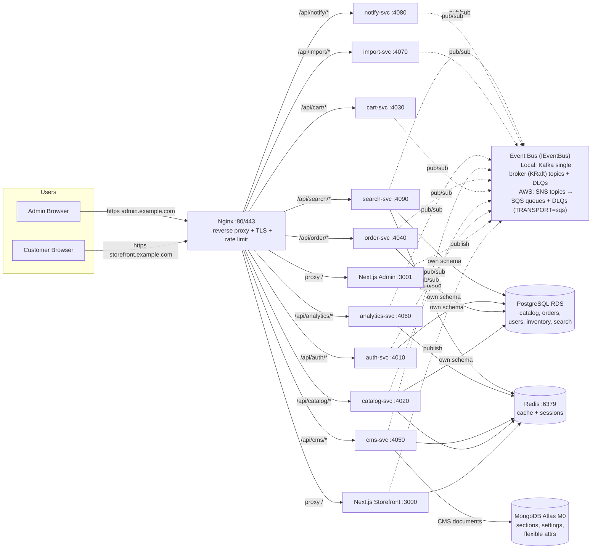
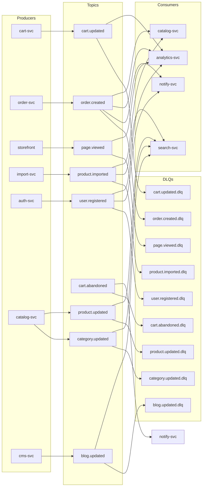
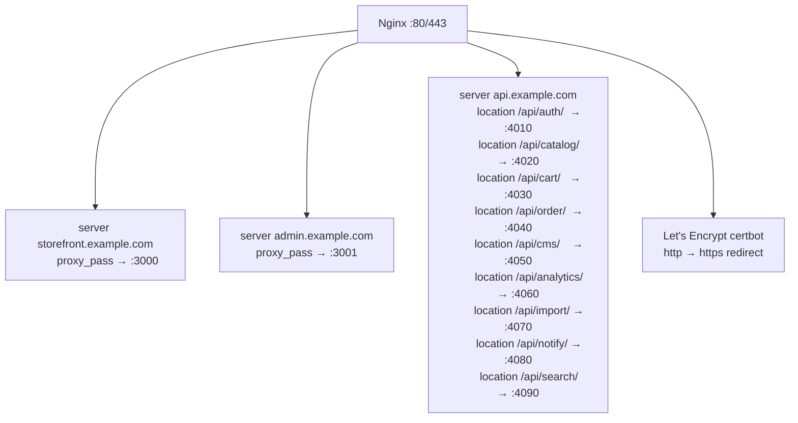
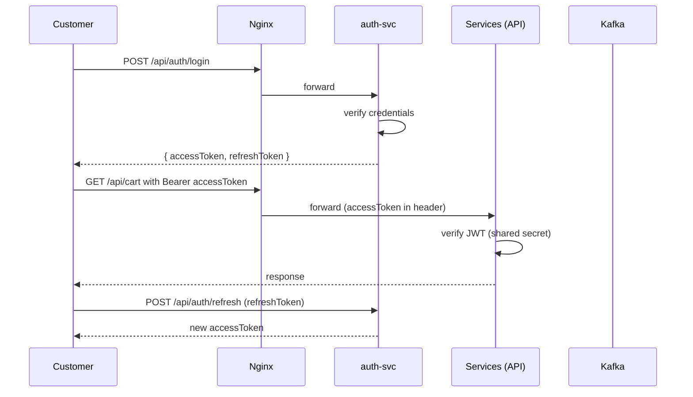
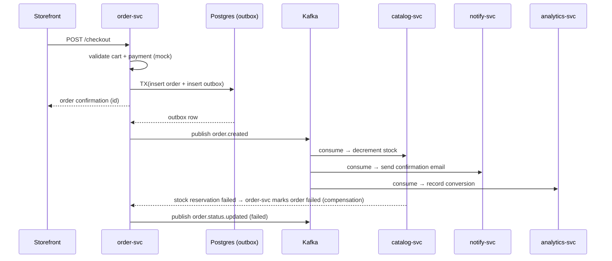
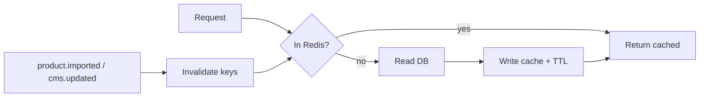
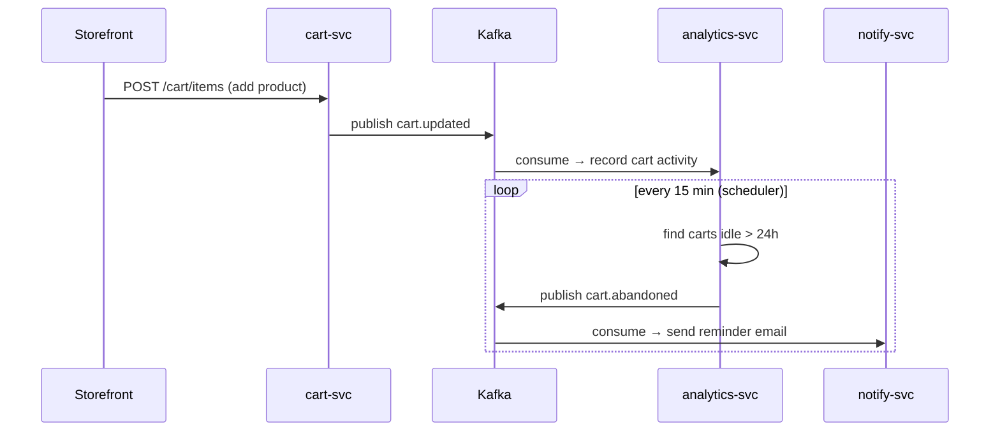
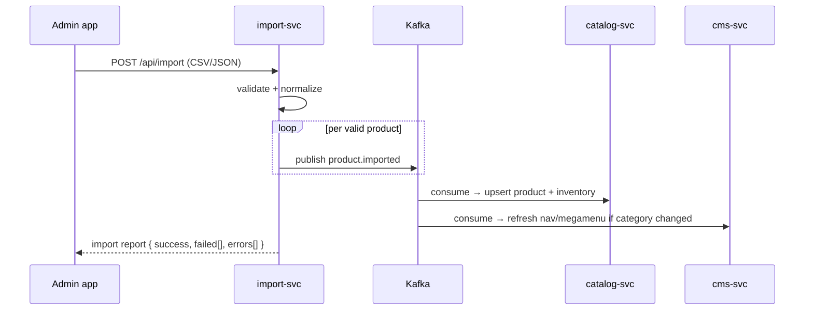
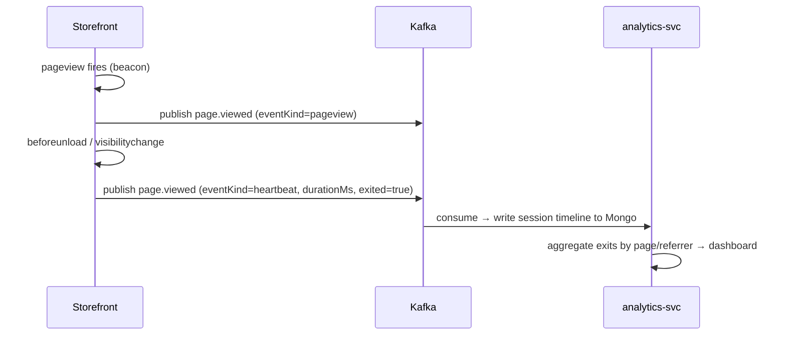

# 1. Architecture

> Microservices, Dual-Transport Event-Driven (Kafka local / SNS→SQS AWS), Nginx Gateway, AWS Deployment
> Status: Draft | Last Updated: 2026-09-03
> Parent: `0.Project-Overview.md` | Repo Model: **Polyrepo (12 repos)** | Learning-based, NOT traffic-scale | Contracts: `@ecom/contracts` (semver, `8.Versioning.md`)

---

## 1. Architecture Principles

1. **HTTP for immediate interactions, event bus for side effects.** Requests that must return a synchronous answer (fetch product, create cart item, authenticate) go over REST via Nginx. Cross-service consequences that can tolerate async (send email, decrement stock, record analytics, trigger abandonment detection) are published as events through `IEventBus` — **Kafka locally (`TRANSPORT=kafka`) / SNS→SQS on AWS (`TRANSPORT=sqs`)**, never via direct service imports. Envelope is transport-agnostic (`@ecom/contracts`).
2. **Service independence & polyrepo.** Each NestJS service lives in its own git repo and owns its data/lifecycle/pipeline; no service reads another service's DB table or imports its code — it consumes events or calls an API. Shared types/events come only from versioned `@ecom/contracts` (semver, `8.Versioning.md`).
3. **Data ownership.** Each database schema/collection is owned by exactly one service. Ownership map in `3.Database-Schema.md`.
4. **Eventual consistency by design.** Reads may lag writes by milliseconds; compensation flows handle partial failure (saga-lite).
5. **Fail-fast for user-facing commands, graceful degradation for reads.** Checkout fails loudly on validation errors; catalog falls back to cache/DB when the bus is down.
6. **Idempotency everywhere.** Every event carries an idempotency key so replays/redeliveries never double-apply (no double stock decrement, no double email). Learning-scale intentionally — NOT traffic-scale (single broker / Standard SQS, no K8s/MSK/ElastiCache in v1).

---

## 2. Updated Budget Context (AWS 2026 Model)

AWS replaced the legacy 12-month free tier for new accounts (July 2025) with a **credit-based Free Plan**:

| Item | Value |
|---|---|
| Signup credit | $100 (automatic) |
| Earnable credit | up to $100 (onboarding activities) |
| Total | up to **$200** |
| Free Plan duration | max **6 months** OR until credits exhausted |
| Always-free services | 30+ (limits apply, no free EC2 hours anymore) |
| After Free Plan ends | account auto-closes; 90-day data grace; upgrade to Paid Plan to continue |
| Credit card | required for identity verification |

**Budget model for this project (AWS):**
- EC2 t3.micro (2 vCPU / 1GB) on-demand: ~$8/mo
- RDS Postgres db.t4g.micro (~20GB): ~$12/mo
- S3 (images) + egress: ~$1/mo
- Messaging: **Local: self-hosted Kafka (KRaft) on EC2 — $0 extra** / **AWS: SNS→SQS — $0–2/mo** (1M req/mo free, then $0.40/M Standard / $0.50/M FIFO, 64KB chunk rule). **MSK is excluded: min ~$460/mo + storage (Serverless ~$547/mo baseline) — would burn $200 in ~2 weeks.**
- Redis, Nginx on EC2: $0
- MongoDB Atlas M0: $0
- **Estimated total: ~$20/mo → ~$120 over 6 months, comfortably inside $200 credits.**

> Cost guardrails: set billing alerts at 50%/25%/10% credit remaining; AWS sends 15/7/2-day expiry mails; stop EC2 when idle; keep an S3 snapshot export of RDS for the 90-day grace migration path. Never join Organization/Control Tower on the learning account (expires credits immediately).

---

## 3. System Diagram



---

## 4. Service Decomposition (9 Services)

| # | Service | Port | Responsibility | Owned Data | Produces | Consumes |
|---|---|---|---|---|---|---|
| 1 | **auth-svc** | 4010 | register/login/logout, JWT + refresh, RBAC, profile | Postgres `auth` schema (users, roles, refresh_tokens) | `user.registered` | — |
| 2 | **catalog-svc** | 4020 | products, categories, brands, variants, inventory, search (basic), compare | Postgres `catalog` schema + S3 image refs | — | `product.imported`, `order.created` (stock) |
| 3 | **cart-svc** | 4030 | cart (guest + user), wishlist, cart TTL | Postgres `cart` schema | `cart.updated` | — |
| 4 | **order-svc** | 4040 | checkout, POS-style order creation, payment (mock), order lifecycle, outbox | Postgres `order` schema + `outbox` table | `order.created`, `order.status.updated` | — |
| 5 | **cms-svc** | 4050 | CMS sections/settings (global + per-section), theme, navigation/megamenu, blogs | Mongo `cms` collections + S3 media | `cms.updated` | `product.imported` (rebuild nav) |
| 6 | **analytics-svc** | 4060 | page-view events, exit tracking, abandoned-cart detection, dashboards | Mongo `analytics` collections + Redis | `cart.abandoned` | `cart.updated`, `page.viewed`, `order.created`, `user.registered` |
| 7 | **import-svc** | 4070 | product import (CSV/JSON v1), validation, event publish | — (stateless) | `product.imported` | — |
| 8 | **notify-svc** | 4080 | email/SMS (SMTP v1) — order confirmation, abandoned cart, welcome | Postgres `notify` schema (email log) | — | `order.created`, `cart.abandoned`, `user.registered`, `order.status.updated` |
| 9 | **search-svc** | 4090 | unified search index (products/categories/blogs) synced via events; typeahead suggest + ranked search | Postgres `search` schema (search_documents) | — | `product.imported`, `product.updated`, `category.updated`, `blog.updated` |

Each service runs as an **independent NestJS app in Docker, in its own git repo**; shared types/events come from versioned `@ecom/contracts` (never from sibling service code). `ecom-infra` pins each image tag immutably in `VERSIONS.env`.

---

## 5. Communication Patterns

| Interaction | Channel | Why |
|---|---|---|
| Storefront → auth (login, profile) | REST | Needs immediate response + token |
| Storefront → catalog (products, search, compare) | REST | Read path; SSR/ISR fetches at request time |
| Storefront → cart (add/update/remove) | REST | Immediate UI feedback; cart-svc publishes `cart.updated` async for analytics |
| Storefront → order (checkout) | REST | Returns order confirmation synchronously; order-svc then emits events |
| Admin → cms (settings, sections) | REST | Save settings; cms-svc publishes `cms.updated` for cache invalidation |
| Admin → import (CSV upload) | REST | Accepts file; import-svc publishes `product.imported` when done |
| Cross-service side effects (stock, email, analytics, abandonment) | `IEventBus` (Kafka local / SNS→SQS AWS) | Async, decoupled, retryable, never blocks user; transport selected by `TRANSPORT` env |
| Analytics ingestion | `IEventBus` | High-volume `page.viewed` must not hit HTTP round-trips; on AWS use Standard queue + batch 10 + long-poll 20s |

> Rule: if the caller needs the result to render a response → REST. If the caller just needs it to eventually happen → event via `IEventBus`. Services never import transport clients directly; they inject `IEventBus` (`KafkaBus` when `TRANSPORT=kafka`, `SnsSqsBus` when `TRANSPORT=sqs`). Envelope is identical (`@ecom/contracts`).

---

## 6. Event Bus Topology — Dual Transport (`IEventBus`: Kafka local / SNS→SQS AWS)

> Services depend only on `IEventBus` (`publish(envelope)` / `subscribe(type, handler)`). Concrete impl is `KafkaBus` when `TRANSPORT=kafka` (local/default) and `SnsSqsBus` when `TRANSPORT=sqs` (AWS). Envelope and `@ecom/contracts` versioning are transport-agnostic (see `8.Versioning.md`).

### 6.1 Broker — Local Transport (Kafka, `TRANSPORT=kafka`)

- **Single broker, KRaft mode** (no Zookeeper — saves ~250MB RAM on t3.micro). **Only on the `local` compose profile; omitted on AWS.**
- Kafka runs as a Docker container on the EC2 host (`kafka:3.x`).
- Auto-create disabled; topics defined declaratively in `docker-compose.yml`/provision script.

### 6.2 Event Envelope (transport-agnostic, versioned in `@ecom/contracts`)
Every event is JSON with a stable envelope (identical on Kafka and SQS):

```json
{
  "id": "uuid-v4",
  "type": "order.created",
  "version": 1,
  "timestamp": "2026-08-15T10:00:00Z",
  "producer": "order-svc",
  "idempotencyKey": "order-123",
  "payload": {}
}
```

See `ecom-contracts/src/events/` for schema source of truth and `8.Versioning.md` for MAJOR/MINOR/PATCH rules (breaking changes use dual-publish window).

### 6.3 Topics, Partitions, Retention, Keying — Local (Kafka)

| Topic | Partitions | Retention | Key | Notes |
|---|---|---|---|---|
| `cart.updated` | 3 | 7d | `userId \| sessionId` | order of updates per cart preserved |
| `cart.abandoned` | 3 | 7d | `userId` | produced by analytics detector |
| `order.created` | 3 | 30d | `orderId` | one event per order; partition per order |
| `order.status.updated` | 3 | 30d | `orderId` | |
| `product.imported` | 1 | 7d | `productId` | low volume, single partition |
| `cms.updated` | 1 | 7d | `sectionKey` | low volume |
| `page.viewed` | 6 | 3d | `sessionId` | high volume, short retention |
| `user.registered` | 1 | 7d | `userId` | |
| `product.updated` | 3 | 7d | `productId` | admin product edits → search-svc + caches |
| `category.updated` | 1 | 7d | `categoryId` | category renames/visibility → search-svc + navbar |
| `blog.updated` | 1 | 7d | `blogId` | blog create/publish/edit → search-svc |

### 6.4 Consumer Groups & DLQ



- One consumer group per (service, topic): e.g. `analytics-svc-cart.updated`, `catalog-svc-order.created`, `search-svc-product.updated`.
- **DLQ (local)**: every source topic has a `.dlq` twin. A consumer that fails N times (default 5 with exponential backoff 1s→2s→4s→8s→16s) publishes the raw event to the DLQ and commits, so the group never stalls. DLQ messages are inspected manually (admin) or via a replay tool.
- **Idempotency**: consumers persist `idempotencyKey` in a processed-events table (or Redis set) and skip already-seen keys — protects against at-least-once redelivery. Same dedupe applies on SQS (Standard queues deliver at-least-once, sometimes out of order).

### 6.5 AWS Transport Variant (SNS→SQS, `TRANSPORT=sqs`)

Omitted locally; provisioned via `ecom-infra/aws/` (Terraform/CDK — SNS topics + SQS queues + redrive DLQs + least-privilege IAM per service).

| Kafka (local) | AWS (SNS→SQS) | AWS notes |
|---|---|---|
| Topic `cart.updated` (3pt, key `userId \| sessionId`, 7d) | SNS `cart.updated` → **FIFO queues** per consumer (e.g. `analytics-cart.updated.fifo`, `notify-cart.updated.fifo`), `MessageGroupId = userId \| sessionId`, 14d retention | FIFO preserves per-cart order; Standard would scramble it |
| `cart.abandoned` (3pt) | FIFO queues per consumer | Same FIFO rule |
| `order.created` (3pt, key `orderId`, 30d) | SNS → **Standard queues** per consumer (e.g. `catalog-order.created`, `notify-order.created`, `analytics-order.created`), `MessageGroupId = orderId` if FIFO needed | Fan-out via SNS; one queue per (service, event) = same isolation as consumer groups |
| `order.status.updated` | Standard queues via SNS | — |
| `product.imported` (1pt) | Standard queues via SNS | Low volume; batch 10 |
| `product.updated`, `category.updated`, `blog.updated` | Standard queues via SNS | Search fan-out; replay unavailable on AWS |
| `cms.updated` (1pt) | Standard queues via SNS | Cache invalidation |
| `page.viewed` (6pt, high volume) | **Standard** queue + **batch size 10 + long-poll 20s** | Order irrelevant; cheapest; batch + long-poll avoids empty-receive cost inflation |
| `user.registered` | Standard queues via SNS | — |

**AWS-specific rules (documented deltas vs Kafka):**
- **DLQ:** SQS redrive policy (`maxReceiveCount 5` → DLQ queue), replaces `.dlq` topics; same 5× backoff philosophy.
- **No log replay / no long retention:** SQS deletes on consume and caps retention at 14d (vs Kafka 3–30d + replay). For learning, use 14d max + optional S3 archive via SNS→S3 for manual replay only. Search re-sync after a bug requires a direct DB scan or archive replay — not a queue feature.
- **Ordering:** FIFO only where order matters (cart/order streams); Standard elsewhere for cost/throughput. FIFO caps apply but fine at our scale.
- **Polling:** always `WaitTimeSeconds 20` (long poll) + `MaxNumberOfMessages 10` + batch `SendMessageBatch`; short polling silently inflates billable requests (64KB chunk rule). FIFO billed $0.50/M, Standard $0.40/M, first 1M/mo free.
- **Envelope:** identical JSON envelope as §6.2; `idempotencyKey` dedupe still required (SQS Standard may double-deliver).

---

## 7. Event Contracts

### 7.1 `cart.updated`
```json
{
  "id": "evt-001",
  "type": "cart.updated",
  "version": 1,
  "timestamp": "2026-08-15T10:00:00Z",
  "producer": "cart-svc",
  "idempotencyKey": "cart-20260815-0001",
  "payload": {
    "cartId": "cart-0001",
    "userId": "user-123",
    "sessionId": "sess-abc",
    "items": [{ "productId": "prod-1", "qty": 2, "unitPrice": 19.99 }],
    "cartTotal": 39.98,
    "status": "active",
    "updatedAt": "2026-08-15T10:00:00Z"
  }
}
```

### 7.2 `cart.abandoned`
```json
{
  "id": "evt-002",
  "type": "cart.abandoned",
  "version": 1,
  "timestamp": "2026-08-16T10:00:00Z",
  "producer": "analytics-svc",
  "idempotencyKey": "abandon-cart-0001",
  "payload": {
    "cartId": "cart-0001",
    "userId": "user-123",
    "email": "user@example.com",
    "items": [{ "productId": "prod-1", "qty": 2 }],
    "cartTotal": 39.98,
    "abandonedAt": "2026-08-16T10:00:00Z"
  }
}
```

### 7.3 `order.created`
```json
{
  "id": "evt-003",
  "type": "order.created",
  "version": 1,
  "timestamp": "2026-08-15T11:00:00Z",
  "producer": "order-svc",
  "idempotencyKey": "order-5000",
  "payload": {
    "orderId": "order-5000",
    "userId": "user-123",
    "items": [{ "productId": "prod-1", "qty": 2 }],
    "totals": { "subtotal": 39.98, "shipping": 5.0, "tax": 2.4, "grandTotal": 47.38 },
    "shippingAddress": { "line1": "...", "city": "...", "postalCode": "..." },
    "status": "pending",
    "createdAt": "2026-08-15T11:00:00Z"
  }
}
```

### 7.4 `order.status.updated`
```json
{
  "id": "evt-004",
  "type": "order.status.updated",
  "version": 1,
  "timestamp": "2026-08-15T14:00:00Z",
  "producer": "order-svc",
  "idempotencyKey": "order-5000-status-2",
  "payload": { "orderId": "order-5000", "from": "pending", "to": "confirmed", "updatedAt": "2026-08-15T14:00:00Z" }
}
```

### 7.5 `product.imported`
```json
{
  "id": "evt-005",
  "type": "product.imported",
  "version": 1,
  "timestamp": "2026-08-15T12:00:00Z",
  "producer": "import-svc",
  "idempotencyKey": "import-batch-9-item-41",
  "payload": {
    "productId": "prod-99",
    "sku": "SKU-099",
    "name": "Example Product",
    "categoryId": "cat-5",
    "brandId": "brand-2",
    "price": 49.99,
    "stock": 100,
    "images": ["https://s3.../prod-99/1.jpg"],
    "customPhotoSettings": { "format": "horizontal", "ratio": "4:3", "blendMode": "multiply" }
  }
}
```

### 7.6 `page.viewed`
```json
{
  "id": "evt-006",
  "type": "page.viewed",
  "version": 1,
  "timestamp": "2026-08-15T09:30:00Z",
  "producer": "storefront",
  "idempotencyKey": "sess-abc-169",
  "payload": {
    "sessionId": "sess-abc",
    "userId": "user-123",
    "page": "/products/prod-1",
    "referrer": "https://google.com",
    "device": { "ua": "...", "mobile": false },
    "durationMs": 42500,
    "exited": true,
    "eventKind": "pageview | heartbeat"
  }
}
```

### 7.7 `user.registered`
```json
{
  "id": "evt-007",
  "type": "user.registered",
  "version": 1,
  "timestamp": "2026-08-15T08:00:00Z",
  "producer": "auth-svc",
  "idempotencyKey": "user-123",
  "payload": { "userId": "user-123", "email": "user@example.com", "registeredAt": "2026-08-15T08:00:00Z" }
}
```

### 7.8 `product.updated`
```json
{
  "id": "evt-008",
  "type": "product.updated",
  "version": 1,
  "timestamp": "2026-08-16T09:00:00Z",
  "producer": "catalog-svc",
  "idempotencyKey": "product-77-edit-3",
  "payload": {
    "productId": "prod-77",
    "sku": "RSX-100",
    "name": "Running Shoe X",
    "slug": "running-shoe-x",
    "categoryId": "cat-1",
    "price": 79.99,
    "stock": 34,
    "status": "active",
    "imageUrl": "https://s3.../prod-77/1.jpg",
    "updatedAt": "2026-08-16T09:00:00Z"
  }
}
```

### 7.9 `category.updated`
```json
{
  "id": "evt-009",
  "type": "category.updated",
  "version": 1,
  "timestamp": "2026-08-16T09:05:00Z",
  "producer": "catalog-svc",
  "idempotencyKey": "cat-1-edit-2",
  "payload": {
    "categoryId": "cat-1",
    "name": "Shoes",
    "slug": "shoes",
    "isActive": true,
    "showInNavbar": true,
    "updatedAt": "2026-08-16T09:05:00Z"
  }
}
```

### 7.10 `blog.updated`
```json
{
  "id": "evt-010",
  "type": "blog.updated",
  "version": 1,
  "timestamp": "2026-08-16T09:10:00Z",
  "producer": "cms-svc",
  "idempotencyKey": "blog-5-edit-1",
  "payload": {
    "blogId": "blog-5",
    "title": "Best Running Shoes 2026",
    "slug": "best-running-shoes-2026",
    "excerpt": "A roundup of the best running shoes...",
    "coverUrl": "https://s3.../blog-5.jpg",
    "status": "published",
    "publishedAt": "2026-08-16T09:10:00Z"
  }
}
```

---

## 8. Nginx Configuration Plan



Key directives planned:
- **Server blocks**: one per domain (storefront, admin, api) with dedicated upstreams.
- **Path-prefix routing**: `api.example.com` routes by first path segment to the right service.
- **Rate limiting**: `limit_req_zone` keyed by IP for `/api/auth` (e.g. 10 req/s) and `/api/order` (e.g. 5 req/s) to blunt brute-force/abuse.
- **Static caching**: `/static/*` and image proxies with `Cache-Control`, immutable for hashed assets.
- **gzip**: on for text content; off for images/PDFs.
- **TLS**: certbot + auto-renew cron; HSTS header.
- **Client body size**: raised (e.g. 25m) for product image uploads via admin.

Full `nginx.conf` in `DOCS/7.Deployment.md`.

---

## 9. Auth & Security



- **JWT**: HS256 access token (short, e.g. 15m) + refresh token (30d, rotated, stored hashed in `auth` schema).
- **RBAC**: roles `customer` / `admin`; admin routes gated by a `RolesGuard` in the admin app and by role claim in JWT on API.
- **Service-to-service**: internal static API keys in v1 (header `x-service-key`) checked by each service; replaced by mTLS/IAM in later phases.
- **CORS**: allowlist storefront + admin origins on the API domain.
- **Secrets**: `.env` files on EC2 (chmod 600) + AWS Secrets Manager as the v2 upgrade path. No secrets committed to git.

---

## 10. Data Consistency Patterns

### 10.1 Transactional Outbox (order-svc)
Order creation and the outbox insert happen in the **same DB transaction**. A relay worker (in-process poller or Debezium later) reads `outbox` and publishes `order.created` → guarantees no order without its event, no event without its order.

### 10.2 Idempotency Keys
Every event carries `idempotencyKey`; consumers dedupe via a processed-keys table/Redis set. Protects against at-least-once redelivery on broker/consumer restart.

### 10.3 Saga-Lite Order Flow (with compensation)



- On stock reservation failure, order-svc marks the order `failed` and emits `order.status.updated` so the customer is notified and funds (mock) are released.

---

## 11. Caching Strategy (Redis)



- **Cache-aside** for catalog reads and CMS settings; TTLs: catalog 5m, CMS global 1m, per-section 5m.
- **Keyspace**: `cat:product:{id}`, `cat:list:{queryHash}`, `cms:section:{key}`, `cms:settings:global`, `sess:{tokenId}`.
- **Invalidation**: consumers of `product.imported` and `cms.updated` delete affected keys.
- **Sessions**: refresh-token sessions in Redis with sliding TTL.
- **Rate limiting**: Redis-backed counters for Nginx-auth and checkout endpoints.

---

## 12. Deployment Topology (EC2 + Docker Compose — Learning-Scale)

Single EC2 **t3.micro** (us-east-1) runs all self-hosted components; Postgres (RDS) and MongoDB (Atlas) are external. **Learning-based, NOT traffic-scale** — same repo shape scales to K8s/MSK later with no code-shape change (see `0.Project-Overview.md §11.4`). **Iterative deploy:** each repo builds its own image (`ghcr.io/<org>/<svc>:<sha>`), `ecom-infra` pins immutable tags in `VERSIONS.env`; small diffs ship one service at a time for fast prod diagnosis.

| Container | Image | Host Port | Profile | Notes |
|---|---|---|---|---|
| nginx | nginx:1.27-alpine | 80, 443 | all | TLS, routing |
| web-storefront | node:20-alpine (Next 16) | 3000 | all | Next.js storefront |
| web-admin | node:20-alpine (Next 16) | 3001 | all | Next.js admin |
| auth-svc | node:20-alpine | 4010 | all | NestJS |
| catalog-svc | node:20-alpine | 4020 | all | NestJS |
| cart-svc | node:20-alpine | 4030 | all | NestJS |
| order-svc | node:20-alpine | 4040 | all | NestJS |
| cms-svc | node:20-alpine | 4050 | all | NestJS |
| analytics-svc | node:20-alpine | 4060 | all | NestJS |
| import-svc | node:20-alpine | 4070 | all | NestJS |
| notify-svc | node:20-alpine | 4080 | all | NestJS |
| search-svc | node:20-alpine | 4090 | all | NestJS |
| kafka | apache/kafka:3.x (KRaft) | 9092 | `local` only | single broker — omitted on AWS when `TRANSPORT=sqs` (saves ~250MB RAM) |
| redis | redis:7-alpine | 6379 | all | cache + sessions |

- Internal Docker network `ecom-net`; only Nginx exposes ports to the host.
- **Health checks** on every service (`/health`) wired into Compose `depends_on` + Nginx passive checks.
- **Restart ordering**: infra (redis, kafka) → databases-ready → services → web apps → nginx.
- DNS: `storefront.example.com`, `admin.example.com`, `api.example.com` → EC2 public IP (Elastic IP).

---

## 13. Resilience & Failure Handling

| Failure | Handling |
|---|---|
| Kafka broker down (local, `TRANSPORT=kafka`) | Consumers block with backoff; order-svc writes events to local outbox (DB) so nothing is lost; storefront reads unaffected (reads are HTTP/Redis). |
| SQS/SNS throttled or unavailable (AWS, `TRANSPORT=sqs`) | `SnsSqsBus` retries with backoff; outbox still buffers `order.created`; CloudWatch alarm on `ApproximateAgeOfOldestMessage` / `ApproximateNumberOfMessagesVisible`. |
| Consumer crash mid-batch | At-least-once delivery + idempotency keys dedupe replays (Kafka and SQS Standard both at-least-once). |
| Poison message | Retry 5× with exponential backoff, then route to DLQ (Kafka `.dlq` topic / SQS redrive `maxReceiveCount 5` → DLQ queue); group/queue never stalls. |
| Redis down | Catalog falls back to DB; sessions degrade to DB lookup; rate limiting bypassed (documented, v1 acceptable). |
| RDS down | Read replicas (traffic-scale); backups daily with 7-day retention + S3 snapshot before Free Plan expiry (v1). |
| Payment provider (mock) down | Checkout returns clear error; order not created. |
| EC2 restart | `docker compose` `restart: unless-stopped`; outbox replay after boot; on AWS, SQS retains up to 14d so backlog survives restart. |

---

## 14. Observability

- **Structured JSON logs** per service (pino/winston) to stdout → Docker logs → CloudWatch Logs on AWS.
- **Health endpoints**: `GET /health` (liveness) + `/health/ready` (deps) on every service → ALB/Compose health checks + CloudWatch alarms (5xx, P99, billing 50/25/10%).
- **Request IDs**: `x-request-id` generated at Nginx, propagated via headers, logged in every service.
- **Transport metrics**: local — consumer lag via `kafka-consumer-groups.sh` (cron) and admin endpoint; AWS — SQS `ApproximateAgeOfOldestMessage` / `ApproximateNumberOfMessagesVisible` / `NumberOfMessagesDelayed` alarms + DLQ depth.
- **Prometheus + Grafana**: traffic-scale goal (annotations now, exporters later). No paid APM in v1 (budget).

---

## 15. Flow Sequence Diagrams

### 15.1 Order Placement
See 10.3 (full sequence above).

### 15.2 Abandoned Cart Pipeline



### 15.3 Product Import



### 15.4 Page-View / Exit Tracking



---

## Related Documents
- `0.Project-Overview.md` — vision, polyrepo model, learning vs traffic scale, budget
- `2.Tech-Stack.md` — libraries, versions, polyrepo layout, `@ecom/contracts` bus abstraction
- `3.Database-Schema.md` — Postgres tables, Mongo collections, ownership map
- `4.API-Design.md` — REST endpoints per service, transport notes
- `7.Deployment.md` — *(to create)* Nginx conf, Docker Compose (local/AWS profiles), `VERSIONS.env` pinning, iterative deploy, AWS Free Plan guardrails
- `8.Versioning.md` — *(to create)* `@ecom/contracts` semver, CHANGELOG, breaking-change window
