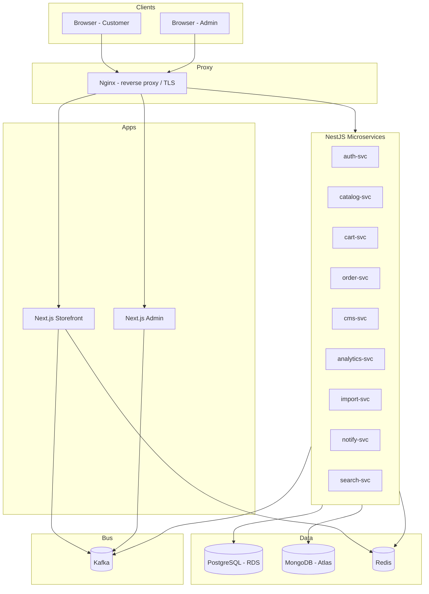

# 2. Tech Stack

> Frameworks, Libraries, Versions & Monorepo Layout
> Status: Draft | Last Updated: 2026-08-15
> Parent: `0.Project-Overview.md` | Sibling: `1.Architecture.md`

---

## 1. Basic Architecture Diagram



---

## 2. Principles

1. **One language everywhere:** TypeScript on frontend, backend, and tooling — share types/models via an internal workspace package.
2. **Boring, proven versions:** pin versions; avoid bleeding-edge majors mid-project.
3. **Minimal magic:** prefer explicit libraries with wide adoption over niche abstractions.
4. **Cost-aware:** every dependency must run comfortably on a t3.micro (1GB RAM) during v1.

---

## 3. Monorepo Layout

```
e-com/
├── package.json                 # npm workspaces root
├── apps/
│   ├── storefront/              # Next.js (customers)
│   └── admin/                   # Next.js (merchants/CMS)
├── services/                    # NestJS microservices
│   ├── auth-svc/
│   ├── catalog-svc/
│   ├── cart-svc/
│   ├── order-svc/
│   ├── cms-svc/
│   ├── analytics-svc/
│   ├── import-svc/
│   ├── notify-svc/
│   └── search-svc/
├── packages/
│   └── shared/                  # types, DTOs, event contracts, kafka wrapper, config
├── infra/
│   ├── docker/                  # Dockerfiles, docker-compose.yml
│   ├── nginx/                   # nginx.conf + site blocks
│   └── scripts/                 # provision, migrate, seed, deploy
└── DOCS/
```

Rationale: npm workspaces give one lockfile, shared builds, and easy local orchestration while keeping each app/service an independently deployable artifact.

---

## 4. Frontend (Apps)

| Choice | Version (pinned) | Why |
|---|---|---|
| Next.js | 14.x (App Router) | SSR/ISR for SEO, Server Components, stable & widely documented |
| React | 18.x | ships with Next.js 14 |
| TypeScript | 5.x | strict mode, shared types |
| Tailwind CSS | 3.4.x | utility-first theming, matches CMS "no-code" styling flexibility |
| React Query (TanStack Query) | 5.x | client data fetching/caching in admin + interactive storefront parts |
| Zustand | 4.x | tiny client state for cart drawer, compare tray |
| next-themes | 0.3.x | dark/light + CMS-driven theme tokens |
| shadcn/ui + Radix | latest stable | accessible primitives for admin forms (optional, on top of Tailwind) |
| Prisma Client (shared) | 5.x | typed DB access used inside Server Components where needed |
| KafkaJS | 2.x | storefront publishes `page.viewed` events (lightweight producer) |

**Storefront vs Admin split:** both are Next.js apps sharing `@ecom/shared`, `packages/ui`, and Tailwind tokens, but with separate domains, builds, and auth guards.

---

## 5. Backend (NestJS Microservices)

| Choice | Version (pinned) | Why |
|---|---|---|
| NestJS | 10.x | DI, modules, guards, interceptors; mature; structured microservices |
| TypeScript | 5.x | shared with frontend |
| @nestjs/microservices (Kafka transport) | 10.x | request-reply + event patterns where convenient |
| KafkaJS | 2.x | direct producer/consumer control: idempotency, DLQ, custom retries |
| @nestjs/config | 3.x | env-based config, validated with Joi/zod |
| class-validator + class-transformer | 0.14.x | DTO validation on REST boundaries |
| JWT (@nestjs/jwt) | 10.x | access + refresh tokens |
| bcrypt / argon2 | latest stable | password hashing (argon2 preferred) |
| Prisma | 5.x | **primary ORM** — typed queries, migrations, easy multi-schema |
| Mongoose | 8.x | MongoDB ODM for cms/analytics collections |
| ioredis | 5.x | Redis client (cache, sessions, rate limit) |
| pino + pino-http | 8.x | structured JSON logs |
| Jest + supertest | 29.x | unit + e2e tests (Nest default) |

**ORM decision — Prisma over TypeORM:** better DX, schema-as-source-of-truth, type-safe queries, solid migrations. Note: Prisma runs a query engine binary (works fine in Alpine with `openssl` present). Multi-schema via `schema.prisma` per service or a shared schema file per ownership domain.

---

## 6. Kafka Layer (`packages/shared` kafka wrapper)

```mermaid
flowchart LR
    subgraph App[Any NestJS service]
        API[Service code] --> W[kafka wrapper]
    end
    W --> P[Producer: publish(type, payload)]
    W --> C[Consumer: subscribe(type, handler)]
    P --> ENV[envelope + idempotencyKey]
    ENV --> RET[retry w/ backoff]
    RET --> DLQ[DLQ on max failures]
    C --> DEDUPE[dedupe by idempotencyKey]
```

Responsibilities of the shared wrapper (single implementation, used by all services):
- Envelope building (`{id, type, version, timestamp, producer, idempotencyKey, payload}`)
- Retry with exponential backoff (1s→2s→4s→8s→16s, max 5)
- DLQ routing on permanent failure
- Idempotency dedupe (Redis set or processed-events table)
- Topic name/partition helpers

---

## 7. Databases

### 7.1 PostgreSQL (RDS db.t4g.micro, Postgres 16)
- **Prisma** as ORM (see §5).
- Owned schemas per service: `auth`, `catalog`, `cart`, `order`, `notify` (ownership map in `DOCS/3.Database-Schema.md`).
- JSONB where flexibility is needed (e.g. product attribute blobs) alongside strict relational tables (orders, inventory).
- Extensions: `pg_trgm` for basic product search (v1), `uuid-ossp`/`gen_random_uuid()`.

### 7.2 MongoDB (Atlas M0 free)
- **Mongoose** as ODM.
- Collections: CMS sections/settings (flexible JSON documents), blogs, analytics events, session timelines.
- M0 limits (512MB storage, no automated backup) — only non-critical/flexible data lives here; orders/inventory stay in Postgres.

### 7.3 Redis (self-hosted on EC2, redis:7)
- **ioredis** client.
- Uses: cache-aside (catalog/CMS), session store, rate-limit counters, idempotency dedupe, consumer coordination.

---

## 8. Proxy & Infrastructure

| Choice | Version | Why |
|---|---|---|
| Nginx | 1.27-alpine | reverse proxy, TLS termination, rate limiting, static caching |
| certbot (Let's Encrypt) | latest | free TLS certs + auto-renew |
| Docker + Docker Compose | latest LTS | local + prod orchestration on EC2 |
| Apache Kafka (KRaft) | 3.7.x (apache/kafka image) | event bus; single broker, no Zookeeper (saves RAM) |
| Node.js runtime | 20.x (LTS) alpine | base for all TS services |
| MongoDB Atlas | M0 free tier | managed Mongo, zero cost |
| AWS RDS | db.t4g.micro, Postgres 16 | managed Postgres (free-tier-sized) |
| AWS S3 | — | product images, media, import files |
| GitHub Actions | — | CI (lint, test, build) + CD (build/push images, deploy to EC2) — phase 2 |

---

## 9. Development Tooling

| Tool | Purpose |
|---|---|
| ESLint (typescript-eslint) | linting, shared config |
| Prettier | formatting |
| Husky + lint-staged | pre-commit hooks |
| Jest | unit tests |
| supertest | HTTP e2e tests per service |
| docker compose | local stack: postgres, mongo, redis, kafka + services |
| dotenv / @nestjs/config | env management |
| commitizen (optional) | conventional commits |

---

## 10. Versioning & Upgrade Policy

- All versions pinned in lockfile; upgrades reviewed deliberately.
- Node 20 LTS until EOL; Next.js stays on 14 while in build-out (majors reviewed after v1).
- Prisma migrations committed to repo; run via `infra/scripts/migrate.sh` before service start.

---

## 11. Cost-Aware Notes

- Single Kafka broker, no Zookeeper (KRaft) — saves ~250MB RAM on t3.micro.
- Alpine images for all runtimes — small footprint.
- Prisma + Mongoose are the only heavy ORMs; avoid second query layer.
- No paid APM/tracing in v1 (Prometheus/Grafana is v2).

---

## Related Documents
- `0.Project-Overview.md` — tech decisions, budget
- `1.Architecture.md` — system design, Kafka topology, deployment
- `3.Database-Schema.md` — Postgres tables, Mongo collections, ownership map
- `4.API-Design.md` — REST endpoints per service
- `7.Deployment.md` — Docker Compose, Nginx conf, AWS setup
