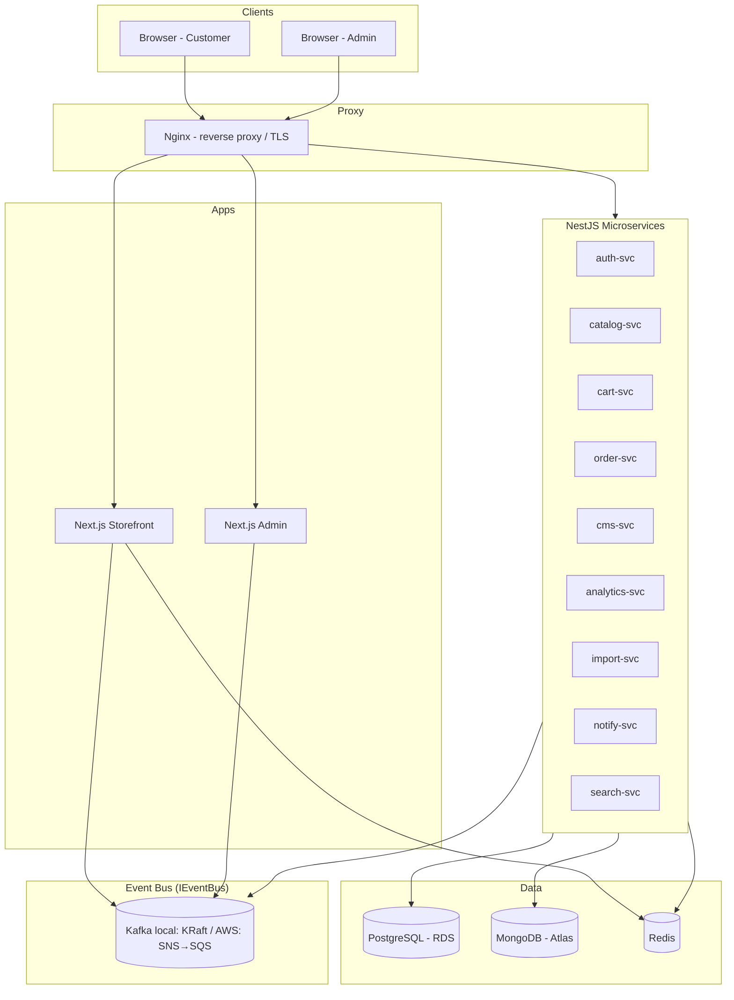
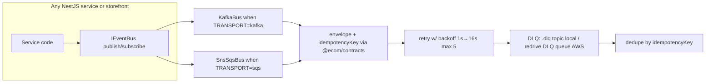

# 2. Tech Stack

> Frameworks, Libraries, Versions & Polyrepo Layout (12 repos) + Dual Transport (Kafka local / SNS→SQS AWS)
> Status: Draft | Last Updated: 2026-09-03
> Parent: `0.Project-Overview.md` | Sibling: `1.Architecture.md` | Contracts: `@ecom/contracts` (see `8.Versioning.md`)

---

## 1. Basic Architecture Diagram



---

## 2. Principles

1. **One language everywhere:** TypeScript on frontend, backend, and tooling — share types via versioned `@ecom/contracts` (not via monorepo imports).
2. **Polyrepo (12 repos, 1 deployable per repo):** storefront-ui, admin-app, ecom-contracts, 9 services (auth/catalog/cart/order/cms/analytics/import/notify/search) + ecom-infra. Independent pipelines, independent deploys, clear ownership.
3. **Learning-based, NOT traffic-scale in v1:** every dependency must run comfortably on a t3.micro (1GB RAM) with single Kafka broker (local) / Standard SQS (AWS); K8s/MSK/ElastiCache are a documented evolution path (see `0.Project-Overview.md §11.4`), not v1.
4. **Boring, proven versions:** pin versions; avoid bleeding-edge majors mid-project except Next 16 (required for React 19).
5. **Minimal magic:** prefer explicit libraries with wide adoption over niche abstractions.
6. **Dual transport via `IEventBus`:** services depend only on `IEventBus.publish/subscribe`; `TRANSPORT=kafka` locally (`KafkaBus` + kafkajs) / `TRANSPORT=sqs` on AWS (`SnsSqsBus` + AWS SDK) — same envelope, same semver (`8.Versioning.md`).

---

## 3. Polyrepo Layout (12 repos — 1 deployable per repo)

Each git repo is independently versioned, built, and deployed. No npm workspaces across repos. Shared code only via versioned `@ecom/contracts`.

```
# Repo: ecom-contracts (npm package @ecom/contracts — semver, see 8.Versioning.md)
ecom-contracts/
├── package.json                 # name @ecom/contracts, version, publishConfig (GitHub Packages)
├── src/
│   ├── events/                  # envelope, topics/queues map, 10 payload types (order.created etc.)
│   ├── dtos/                    # per-service REST DTOs + error codes
│   └── schemas/                 # cta.schema.ts (z.array(ctaSchema).max(3)), heroSlide.schema.ts
├── openapi/                     # generated per release (read-only)
├── CHANGELOG.md                 # Keep-a-Changelog
└── VERSIONING.md                # semver rules (PATCH/MINOR/MAJOR)

# Repo: storefront-ui (Next.js 16 + React 19)           # Vercel or EC2 :3000
storefront-ui/
├── package.json / next.config.ts / tsconfig.json
├── src/app/                     # App Router: layout.tsx, globals.css, page.tsx
└── src/ui/baseComponents/       # Button, Input, Checkbox, Radio, Toggle (migrated from storefront/ui)

# Repo: admin-app (Next.js 16)                           # :3001
admin-app/
├── src/app/                     # dashboard, CMS/theme/nav, orders, customers...
└── src/components/              # Table, MediaPickerModal, TreeView...

# Repo per service (example: order-svc — same skeleton for 9 services)
order-svc/                        # NestJS :4040
├── Dockerfile                   # node:20-alpine, openssl for Prisma, HEALTHCHECK /health
├── .env.example                 # TRANSPORT=kafka| sqs, DATABASE_URL, KAFKA_BROKERS or AWS_REGION/SNS_PREFIX/SQS_PREFIX
├── prisma/
│   ├── schema.prisma            # ONLY its own schema (order schema)
│   └── migrations/
├── src/
│   ├── main.ts                  # pino, x-request-id, ValidationPipe, Swagger /docs
│   ├── app.module.ts
│   ├── messaging/               # IEventBus port: event-bus.interface.ts, kafka-bus.ts, sqs-bus.ts, messaging.module.ts (forRoot picks by TRANSPORT)
│   ├── modules/<domain>/        # controller, service, repository
│   └── common/                  # guards (JwtAuth, Roles, x-service-key), filters, interceptors
└── .github/workflows/ci.yml     # lint → test → build → push ghcr.io/<org>/order-svc:<sha>

# Other service repos (same skeleton): auth-svc :4010, catalog-svc :4020, cart-svc :4030,
#   cms-svc :4050, analytics-svc :4060, import-svc :4070, notify-svc :4080, search-svc :4090

# Repo: ecom-infra (deploy coordination)
ecom-infra/
├── docker-compose.yml           # pins image tags immutably; kafka in `local` profile only
├── VERSIONS.env                 # <svc>=ghcr.io/<org>/<svc>:<tag> — single place to bump
├── nginx/nginx.conf + site blocks
├── scripts/migrate.sh / seed.sh
└── aws/sqs.tf                   # SNS topics + SQS queues + DLQs + IAM (AWS profile only)
```

Rationale: polyrepo gives independent pipelines (`main` push → ship one service), clear ownership, and forces contract versioning discipline — the core learning goal. `monorepo + @ecom/shared` is kept only as a local-dev alternative, not the deployed model.

---

## 4. Frontend (Apps)

| Choice | Version (pinned) | Why |
|---|---|---|
| Next.js | **16.x** (App Router) | SSR/ISR for SEO, Server Components; **required for React 19** — `2.` and design-system locked to 16 |
| React | **19.x** | ships with Next.js 16; current Vite preview already on 19 |
| TypeScript | 5.x | strict mode, shared types |
| Tailwind CSS | 3.4.x | utility-first theming, matches CMS "no-code" styling flexibility |
| React Query (TanStack Query) | 5.x | client data fetching/caching in admin + interactive storefront parts |
| Zustand | 4.x | tiny client state for cart drawer, compare tray |
| next-themes | 0.3.x | dark/light + CMS-driven theme tokens |
| shadcn/ui + Radix | latest stable | accessible primitives for admin forms (optional, on top of Tailwind) |
| Prisma Client (shared) | 5.x | typed DB access used inside Server Components where needed |
| KafkaJS | 2.x | storefront publishes `page.viewed` via `KafkaBus` when `TRANSPORT=kafka` (local) |
| `@aws-sdk/client-sns` + `@aws-sdk/client-sqs` | 3.x | SNS→SQS publish/subscribe via `SnsSqsBus` when `TRANSPORT=sqs` (AWS) |
| Zod | 3.x | runtime schema for CMS `ctas[]` max 3 (hero/banner) + contract validation from `@ecom/contracts` |

**Storefront vs Admin split:** both are separate git repos (polyrepo) sharing only `@ecom/contracts` + Tailwind tokens, with separate domains, builds, and auth guards.

---

## 5. Backend (NestJS Microservices)

| Choice | Version (pinned) | Why |
|---|---|---|
| NestJS | 10.x | DI, modules, guards, interceptors; mature; structured microservices |
| TypeScript | 5.x | shared with frontend |
| @nestjs/microservices (Kafka transport) | 10.x | request-reply + event patterns where convenient |
| KafkaJS | 2.x | `KafkaBus` — direct producer/consumer control: idempotency, DLQ, custom retries (active when `TRANSPORT=kafka`) |
| `@aws-sdk/client-sns` + `@aws-sdk/client-sqs` | 3.x | `SnsSqsBus` — SNS publish + SQS long-poll (20s) + batch 10 + redrive DLQ (active when `TRANSPORT=sqs`) |
| @nestjs/config | 3.x | env-based config (`TRANSPORT`, `AWS_REGION`, `SNS_PREFIX`/`SQS_PREFIX` or `KAFKA_BROKERS`), validated with Joi/zod |
| class-validator + class-transformer | 0.14.x | DTO validation on REST boundaries (retained for Nest DTOs) |
| Zod | 3.x | primary for `cms_sections` content validation (`shared/src/schemas/cta.schema.ts` — `ctas[]` max 3, hero/banner slides) |
| JWT (@nestjs/jwt) | 10.x | access + refresh tokens |
| bcrypt / argon2 | latest stable | password hashing (argon2 preferred) |
| Prisma | 5.x | **primary ORM** — typed queries, migrations, easy multi-schema |
| Mongoose | 8.x | MongoDB ODM for cms/analytics collections |
| ioredis | 5.x | Redis client (cache, sessions, rate limit) |
| pino + pino-http | 8.x | structured JSON logs |
| Jest + supertest | 29.x | unit + e2e tests (Nest default) |

**ORM decision — Prisma over TypeORM:** better DX, schema-as-source-of-truth, type-safe queries, solid migrations. Note: Prisma runs a query engine binary (works fine in Alpine with `openssl` present). Multi-schema via `schema.prisma` per service or a shared schema file per ownership domain.

---

## 6. Event Bus Layer (`@ecom/contracts` + `IEventBus` — Kafka local / SNS→SQS AWS)



Responsibilities of `IEventBus` (single port, two impls, envelope from `@ecom/contracts` — never direct kafkajs/sqs imports in service code):
- Envelope building (`{id, type, version, timestamp, producer, idempotencyKey, payload}`) from `@ecom/contracts`
- Retry with exponential backoff (1s→2s→4s→8s→16s, max 5) — Kafka DLQ topic vs SQS redrive `maxReceiveCount 5`
- DLQ routing on permanent failure (local: `.dlq` topic; AWS: DLQ queue)
- Idempotency dedupe (Redis set or processed-events table) — required on both; SQS Standard is at-least-once
- Topic/queue name helpers from `@ecom/contracts` (`src/events/transport.ts` — partitions/keys vs FIFO `MessageGroupId` / Standard + batch 10 + long-poll 20s)
- Zod validation for CMS content (`@ecom/contracts/src/schemas/cta.schema.ts` — `ctas[]` max 3) before publish
- `messaging/messaging.module.ts` `forRoot()` picks `KafkaBus` vs `SnsSqsBus` by `TRANSPORT` env

---

## 7. Databases

### 7.1 PostgreSQL (RDS db.t4g.micro, Postgres 16)
- **Prisma** as ORM (see §5).
- Owned schemas per service: `auth`, `catalog`, `cart`, `order`, `notify` (ownership map in `DOCS/3.Database-Schema.md`).
- JSONB where flexibility is needed (e.g. product attribute blobs) alongside strict relational tables (orders, inventory).
- Extensions: `pg_trgm` for basic product search (v1), `uuid-ossp`/`gen_random_uuid()`.

### 7.2 MongoDB (Atlas M0 free)
- **Mongoose** as ODM.
- Collections: CMS sections/settings (flexible JSON documents), blogs, analytics events, session timelines.
- M0 limits (512MB storage, no automated backup) — only non-critical/flexible data lives here; orders/inventory stay in Postgres.

### 7.3 Redis (self-hosted on EC2, redis:7)
- **ioredis** client.
- Uses: cache-aside (catalog/CMS), session store, rate-limit counters, idempotency dedupe, consumer coordination.

---

## 8. Proxy & Infrastructure

| Choice | Version | Why |
|---|---|---|
| Nginx | 1.27-alpine | reverse proxy, TLS termination, rate limiting, static caching |
| certbot (Let's Encrypt) | latest | free TLS certs + auto-renew |
| Docker + Docker Compose | latest LTS | local + prod orchestration on EC2 (`local` profile includes Kafka, `aws` profile omits it) |
| Apache Kafka (KRaft) | 3.7.x (apache/kafka image) | **local transport only** (`TRANSPORT=kafka`); single broker, no Zookeeper (saves ~250MB) — omitted on AWS |
| AWS SNS→SQS | — | **AWS transport** (`TRANSPORT=sqs`) — SNS topics → SQS queues per consumer (FIFO where ordered); $0–2/mo, first 1M req free |
| AWS SDK (`@aws-sdk/client-sns/sqs`) | 3.x | `SnsSqsBus` impl; long-poll 20s + batch 10 + redrive DLQ |
| Node.js runtime | 20.x (LTS) alpine | base for all TS services |
| MongoDB Atlas | M0 free tier | managed Mongo, zero cost |
| AWS RDS | db.t4g.micro, Postgres 16 | managed Postgres (Free Plan credits) |
| AWS S3 | — | product images, media, import files, DB snapshots for 90-day grace |
| GitHub Actions | — | Per-repo CI (lint, test, build, push `ghcr.io/<org>/<svc>:<sha>`) — `ecom-infra` pins tags in `VERSIONS.env` |

---

## 9. Development Tooling

| Tool | Purpose |
|---|---|
| ESLint (typescript-eslint) | linting, shared config |
| Prettier | formatting |
| Husky + lint-staged | pre-commit hooks |
| Jest | unit tests |
| supertest | HTTP e2e tests per service |
| docker compose | local stack: postgres, mongo, redis, kafka + services |
| dotenv / @nestjs/config | env management |
| commitizen (optional) | conventional commits |

---

## 10. Versioning & Upgrade Policy

- All versions pinned in lockfile; upgrades reviewed deliberately. `@ecom/contracts` pinned without `^` in every svc/app; breaking event/DTO change = MAJOR (see `8.Versioning.md` + CHANGELOG).
- Node 20 LTS until EOL; **Next.js 16 + React 19 locked** (no downgrade to 14); majors reviewed after v1.
- Prisma migrations committed per service repo; run via `ecom-infra/scripts/migrate.sh` before service start; `VERSIONS.env` pins each image tag immutably (never `:latest`).

---

## 11. Cost-Aware Notes (Learning-Scale)

- Single Kafka broker **only on `local` profile** — KRaft saves ~250MB; omitted entirely on AWS (`TRANSPORT=sqs`) to save RAM.
- **MSK is excluded** — min ~$460/mo + storage would burn $200 credits in ~2 weeks; SNS→SQS on AWS is $0–2/mo at our volume (1M free, then $0.40/M Standard / $0.50/M FIFO).
- Alpine images for all runtimes — small footprint.
- Prisma + Mongoose are the only heavy ORMs; avoid second query layer.
- No paid APM/tracing in v1 (Prometheus/Grafana is traffic-scale).

---

## Related Documents
- `0.Project-Overview.md` — tech decisions, polyrepo model, learning vs traffic scale
- `1.Architecture.md` — system design, dual-transport topology (Kafka local / SNS→SQS AWS), deployment
- `3.Database-Schema.md` — Postgres tables, Mongo collections, ownership map
- `4.API-Design.md` — REST endpoints per service, transport notes
- `7.Deployment.md` — *(to create)* Docker Compose (local/AWS profiles), Nginx conf, `VERSIONS.env` pinning, AWS Free Plan guardrails
- `8.Versioning.md` — *(to create)* `@ecom/contracts` semver, CHANGELOG, breaking-change window
