# 3. Database Schema

> Full Column Definitions, Data Types, Constraints & Indexes — with reasons
> Status: Draft | Last Updated: 2026-08-16
> Source of truth: `temp.md` (table inventory) | Parent: `0.Project-Overview.md`

---

## 1. Overview & Ownership Map

| Service | Store | Schema / Collection | Owns |
|---|---|---|---|
| auth-svc | PostgreSQL | `auth` | users, addresses, refresh_tokens, roles, permissions, role_permissions, user_roles |
| catalog-svc | PostgreSQL | `catalog` | categories, brands, products, variants, images, options, compare attributes, stock ledger, discounts, reviews |
| cart-svc | PostgreSQL | `cart` | carts, cart_items, wishlists, wishlist_items |
| order-svc | PostgreSQL | `order` | orders, order_items, status history, payments, outbox, discount_codes, shipments |
| notify-svc | PostgreSQL | `notify` | email_logs, notification_templates |
| import-svc | PostgreSQL | `import` | import_jobs |
| search-svc | PostgreSQL | `search` | search_documents (synced index) |
| cms-svc | MongoDB | `cms_*` | sections, settings, navigation, pages, blogs, media |
| analytics-svc | MongoDB | `analytics_*` | page_views, sessions, cart_events, abandoned_carts, daily_stats |
| — | Redis | keyspaces | sessions, cache, rate limits, idempotency, compare lists |

```mermaid
flowchart LR
    subgraph P[PostgreSQL - single RDS instance, 7 schemas]
        A[auth]
        CA[catalog]
        CR[cart]
        O[order]
        N[notify]
        I[import]
        S[search]
    end
    subgraph M[MongoDB Atlas - 12 collections]
        CMS[cms sections/settings/nav/pages/blogs/media]
        AN[page_views/sessions/cart_events/abandoned_carts/daily_stats]
    end
    subgraph R[Redis]
        RD[cache + sessions + rate limit + idempotency + compare]
    end
    A -. logical refs .-> O
    CA -. logical refs .-> O
    CA -. logical refs .-> CR
```

**Cross-schema reference policy (important):** all Postgres schemas share one RDS instance, but **foreign keys exist only within a schema**. References to another service's table (e.g. `cart_items.product_id` → `catalog.products`) are **logical UUID columns without FK constraints**. This keeps services independently deployable and migration-safe (a service can't be blocked by another service's table lifecycle). Trade-off: integrity is enforced by application code — documented and accepted.

---

## 2. Global Conventions (applied to every table)

| Convention | Decision | Reason |
|---|---|---|
| Primary keys | `uuid` PK, generated as **UUID v7** by Prisma `@default(uuid(7))` | Time-ordered (index-friendly inserts), unguessable, safe for use as Kafka event keys, collision-proof across future merges (Shopify syncs) |
| Timestamps | `created_at` + `updated_at`, type `timestamptz NOT NULL DEFAULT now()` | UTC-normalized, DST-proof, auto-set |
| Money | `DECIMAL(12,2)` + `CHECK (col >= 0)` | Exact decimal arithmetic (no float drift); 12,2 covers 10 billion in minor precision; single currency USD in v1 |
| Enums | `varchar` + `CHECK (col IN (...))` | Adding a value = alter constraint, no ENUM-type migration friction, Prisma-friendly |
| Soft deletes | `deleted_at timestamptz NULL` on **products, categories, brands** only | Accidental-delete recovery on catalog data; other tables are ephemeral (carts) or audit-only (orders) |
| Workflow status | `status` varchar column with CHECK on publishable entities | draft/active/archived lifecycle separate from deletion |
| Search | `search_vector tsvector GENERATED ALWAYS AS (to_tsvector('english', name \|\| ' ' \|\| coalesce(description, ''))) STORED` + GIN index (products, categories) | Generated column = always consistent, no trigger; GIN = fast full-text search; English v1, configurable later |
| Naming | snake_case, plural table names, `idx_{table}_{columns}` for indexes | Readable, conventional |
| FK indexing | **Explicit index on every FK column** | Postgres does NOT auto-index FKs; without it, child lookups do seq scans |
| Cross-schema refs | Logical UUID columns, no FK (see §1) | Service independence |
| IDs in events | `idempotencyKey` uses the aggregate UUID | Exactly-once processing across services |

---

## 3. PostgreSQL Schemas

> Column tables: `column | type | constraints | reason`. Index tables: `index | columns | type | reason`.

### 3.1 `auth` schema — auth-svc

#### users
| Column | Type | Constraints | Reason |
|---|---|---|---|
| id | uuid | PK, default uuid(7) | Global PK convention |
| email | varchar(255) | NOT NULL, UNIQUE | Login key; lowercase normalized at app layer (avoids citext extension) |
| password_hash | varchar(255) | NOT NULL | Argon2 hash output fits 255 |
| first_name | varchar(100) | NOT NULL | |
| last_name | varchar(100) | NOT NULL | |
| phone | varchar(20) | NULL | Optional contact |
| avatar_url | varchar(2048) | NULL | S3 object URL |
| status | varchar(20) | NOT NULL DEFAULT 'active', CHECK IN ('active','disabled','pending') | Enum convention — account lifecycle |
| last_login_at | timestamptz | NULL | Login analytics, idle detection |
| created_at / updated_at | timestamptz | NOT NULL DEFAULT now() | Convention |

**Indexes**
| Index | Columns | Type | Reason |
|---|---|---|---|
| (PK) | id | btree | Row identity |
| users_email_key | email | **unique** btree | Login lookup — the single hottest auth query |
| idx_users_status | status | btree | Admin filtering by status |

#### addresses
| Column | Type | Constraints | Reason |
|---|---|---|---|
| id | uuid | PK | Convention |
| user_id | uuid | NOT NULL, FK → auth.users(id) | Same-schema FK allowed |
| type | varchar(10) | NOT NULL DEFAULT 'shipping', CHECK IN ('shipping','billing') | Enum convention |
| label | varchar(50) | NULL | e.g. "Home", "Office" |
| line1 | varchar(255) | NOT NULL | |
| line2 | varchar(255) | NULL | |
| city | varchar(100) | NOT NULL | |
| state | varchar(100) | NULL | Optional for some countries |
| postal_code | varchar(20) | NOT NULL | |
| country | varchar(2) | NOT NULL DEFAULT 'US' | ISO-3166 alpha-2 |
| is_default | boolean | NOT NULL DEFAULT false | Default address for checkout |
| created_at / updated_at | timestamptz | NOT NULL | Convention |

**Indexes**
| Index | Columns | Type | Reason |
|---|---|---|---|
| (PK) | id | btree | Identity |
| idx_addresses_user_id | user_id | btree | FK — load a user's address book |
| one_default_per_user | user_id | **unique, partial WHERE is_default** | Enforces at most one default address per user |

#### refresh_tokens
| Column | Type | Constraints | Reason |
|---|---|---|---|
| id | uuid | PK | Convention |
| user_id | uuid | NOT NULL, FK → auth.users(id) | Same-schema FK |
| token_hash | varchar(255) | NOT NULL, UNIQUE | SHA-256 of the raw token — **never store raw tokens** |
| expires_at | timestamptz | NOT NULL | Token rotation (30d) |
| revoked_at | timestamptz | NULL | Explicit revocation on rotate/logout |
| created_at | timestamptz | NOT NULL | Convention |

**Indexes**
| Index | Columns | Type | Reason |
|---|---|---|---|
| (PK) | id | btree | Identity |
| refresh_tokens_token_hash_key | token_hash | **unique** btree | Refresh lookup by hash |
| idx_refresh_tokens_user_id | user_id | btree | FK — revoke all on password change |
| idx_refresh_tokens_expires_at | expires_at | btree | Cleanup job for expired rows |

#### roles / permissions / role_permissions / user_roles (full RBAC)
| Table | Column | Type | Constraints | Reason |
|---|---|---|---|---|
| roles | id | uuid | PK | |
| roles | name | varchar(50) | NOT NULL | Display name |
| roles | slug | varchar(50) | NOT NULL, UNIQUE | 'admin', 'customer' — code reference |
| roles | description | varchar(255) | NULL | |
| roles | created_at / updated_at | timestamptz | NOT NULL | |
| permissions | id | uuid | PK | |
| permissions | name | varchar(100) | NOT NULL | "Create product" |
| permissions | slug | varchar(100) | NOT NULL, UNIQUE | 'product.create' — checked by guard |
| permissions | description | varchar(255) | NULL | |
| role_permissions | role_id | uuid | NOT NULL, FK → roles, **composite PK (role_id, permission_id)** | Join; composite PK dedupes |
| role_permissions | permission_id | uuid | NOT NULL, FK → permissions | |
| user_roles | user_id | uuid | NOT NULL, FK → users, **composite PK (user_id, role_id)** | Join; multi-role support |
| user_roles | role_id | uuid | NOT NULL, FK → roles | |

**Indexes**
| Index | Columns | Type | Reason |
|---|---|---|---|
| (PKs) | composite | btree | Identity + dedupe |
| idx_role_permissions_permission_id | permission_id | btree | Reverse FK lookup ("who grants this permission") |
| idx_user_roles_role_id | role_id | btree | Reverse FK lookup ("which users are admins") |

---

### 3.2 `catalog` schema — catalog-svc

#### categories
| Column | Type | Constraints | Reason |
|---|---|---|---|
| id | uuid | PK | Convention |
| parent_id | uuid | NULL, FK → categories(id) | Self-referencing tree |
| name | varchar(150) | NOT NULL | |
| slug | varchar(180) | NOT NULL, UNIQUE | URL segment |
| description | text | NULL | Category blurb |
| image_url | varchar(2048) | NULL | S3 image |
| is_active | boolean | NOT NULL DEFAULT true | Publish switch |
| show_in_navbar | boolean | NOT NULL DEFAULT false | CMS navbar visibility |
| show_in_megamenu | boolean | NOT NULL DEFAULT false | CMS megamenu visibility |
| megamenu_show_images | boolean | NOT NULL DEFAULT false | CMS megamenu image toggle |
| sort_order | integer | NOT NULL DEFAULT 0 | Navbar ordering |
| settings | jsonb | NOT NULL DEFAULT '{}' | Per-category CMS overrides (photo format, ratio...) |
| deleted_at | timestamptz | NULL | Soft-delete convention (catalog only) |
| search_vector | tsvector | GENERATED ALWAYS AS (to_tsvector('english', name \|\| ' ' \|\| coalesce(description,''))) STORED | Search convention |
| created_at / updated_at | timestamptz | NOT NULL | Convention |

**Indexes**
| Index | Columns | Type | Reason |
|---|---|---|---|
| (PK) | id | btree | Identity |
| categories_slug_key | slug | **unique** btree | URL routing lookup |
| idx_categories_parent_id | parent_id | btree | FK — tree traversal/children queries |
| idx_categories_search_vector | search_vector | **GIN** | Category search |
| idx_categories_navbar | (is_active, show_in_navbar, sort_order) | **partial btree WHERE is_active AND show_in_navbar** | Navbar render = one narrow index read |

#### brands
| Column | Type | Constraints | Reason |
|---|---|---|---|
| id | uuid | PK | |
| name | varchar(150) | NOT NULL | |
| slug | varchar(180) | NOT NULL, UNIQUE | |
| logo_url | varchar(2048) | NULL | S3 logo |
| description | text | NULL | |
| is_active | boolean | NOT NULL DEFAULT true | |
| sort_order | integer | NOT NULL DEFAULT 0 | Brands page ordering |
| deleted_at | timestamptz | NULL | Soft-delete convention |
| created_at / updated_at | timestamptz | NOT NULL | |

**Indexes:** PK; unique slug (brands page lookup); `idx_brands_active` partial `WHERE is_active` (brands page listing).

#### products
| Column | Type | Constraints | Reason |
|---|---|---|---|
| id | uuid | PK | Convention |
| sku | varchar(64) | NOT NULL, UNIQUE | External identifier, unique across sources |
| name | varchar(255) | NOT NULL | |
| slug | varchar(280) | NOT NULL, UNIQUE | URL segment |
| short_description | varchar(500) | NULL | Listing card text |
| description | text | NULL | PDP rich text (CMS blocks can override) |
| category_id | uuid | NULL, FK → categories(id) | Same-schema FK; nullable for unassigned |
| brand_id | uuid | NULL, FK → brands(id) | |
| price | DECIMAL(12,2) | NOT NULL, CHECK (price >= 0) | Money convention — base price |
| compare_at_price | DECIMAL(12,2) | NULL, CHECK (compare_at_price >= 0) | Marketing "was" price (not a discount engine) |
| stock | integer | NOT NULL DEFAULT 0, CHECK (stock >= 0) | Running balance; ledger lives in stock_movements (balance + ledger pattern) |
| status | varchar(20) | NOT NULL DEFAULT 'draft', CHECK IN ('draft','active','archived') | Workflow status convention |
| tags | varchar(50)[] | NULL | Postgres array is atomic & GIN-indexable; avoids a join for a flat tag list (accepted 1NF exception) |
| attributes | jsonb | NOT NULL DEFAULT '{}' | Free-form attribute bag for non-compare specs |
| photo_settings | jsonb | NOT NULL DEFAULT '{}' | **Per-product CMS overrides**: {format, ratio, layout, gutter, widthPercent, blendMode, showPhotos} |
| source | varchar(20) | NOT NULL DEFAULT 'local', CHECK IN ('local','shopify','bigcommerce','odoo') | Import source — idempotent syncs |
| external_id | varchar(255) | NULL | Source's ID (Shopify product id) for re-sync matching |
| weight_g | integer | NULL | Shipping calc later |
| deleted_at | timestamptz | NULL | Soft-delete convention |
| search_vector | tsvector | GENERATED STORED (name + short_description + description) | Search convention |
| created_at / updated_at | timestamptz | NOT NULL | |

**Indexes**
| Index | Columns | Type | Reason |
|---|---|---|---|
| (PK) | id | btree | Identity; used as Kafka key for product events |
| products_sku_key | sku | **unique** btree | Import upsert by SKU |
| products_slug_key | slug | **unique** btree | PDP URL lookup — hottest catalog query |
| idx_products_category_id | category_id | btree | FK — category page listing |
| idx_products_brand_id | brand_id | btree | FK — brand page listing |
| idx_products_search_vector | search_vector | **GIN** | Full-text search |
| idx_products_active | status | **partial btree WHERE status = 'active'** | All storefront listings filter active only; tiny index |
| idx_products_tags | tags | **GIN** | Tag-filtered searches |
| products_source_external_key | (source, external_id) | **unique, partial WHERE external_id IS NOT NULL** | Idempotent Shopify/BigCommerce/Odoo re-imports — no duplicates |
| idx_products_active_price | (status, price) | **partial btree WHERE status = 'active'** | Price-sorted listing pages (popular sort) |

#### product_variants
| Column | Type | Constraints | Reason |
|---|---|---|---|
| id | uuid | PK | |
| product_id | uuid | NOT NULL, FK → products(id) | Same-schema FK; cascade delete |
| sku | varchar(64) | NOT NULL, UNIQUE | Variant-level inventory identity |
| price | DECIMAL(12,2) | NOT NULL, CHECK (price >= 0) | Overrides product price when set |
| stock | integer | NOT NULL DEFAULT 0, CHECK (stock >= 0) | Balance + ledger (movements reference variant_id) |
| image_url | varchar(2048) | NULL | Variant-specific image |
| is_active | boolean | NOT NULL DEFAULT true | Hide a variant (sold-out config) |
| created_at / updated_at | timestamptz | NOT NULL | |

**Indexes**
| Index | Columns | Type | Reason |
|---|---|---|---|
| (PK) | id | btree | |
| product_variants_sku_key | sku | **unique** btree | Import upsert |
| idx_product_variants_product_id | product_id | btree | FK — PDP variant selector; the "400 variants per product" read |
| idx_product_variants_active | product_id, is_active | **partial btree WHERE is_active** | Selector only shows active variants |

#### product_images
| Column | Type | Constraints | Reason |
|---|---|---|---|
| id | uuid | PK | |
| product_id | uuid | NOT NULL, FK → products(id) | Cascade delete |
| variant_id | uuid | NULL, FK → product_variants(id) | Optional variant-scoped image |
| url | varchar(2048) | NOT NULL | S3 object URL |
| alt | varchar(255) | NULL | SEO/accessibility |
| sort_order | integer | NOT NULL DEFAULT 0 | Gallery ordering |
| is_primary | boolean | NOT NULL DEFAULT false | Listing thumbnail |
| created_at | timestamptz | NOT NULL | |

**Indexes**
| Index | Columns | Type | Reason |
|---|---|---|---|
| (PK) | id | btree | |
| idx_product_images_product_order | (product_id, sort_order) | btree | FK + gallery order in one index — PDP gallery read |
| idx_product_images_variant_id | variant_id | btree | FK |
| one_primary_per_product | product_id | **unique, partial WHERE is_primary** | At most one primary image per product |

#### product_options (attribute definitions — stored once)
| Column | Type | Constraints | Reason |
|---|---|---|---|
| id | uuid | PK | |
| product_id | uuid | NOT NULL, FK → products(id) | Cascade |
| name | varchar(100) | NOT NULL | "Size", "Color" — definition stored once |
| position | integer | NOT NULL DEFAULT 0 | Selector ordering |
| created_at / updated_at | timestamptz | NOT NULL | |

**Indexes:** PK; `idx_product_options_product_id` (FK — load option set for PDP).

#### product_option_values (values — stored once)
| Column | Type | Constraints | Reason |
|---|---|---|---|
| id | uuid | PK | |
| option_id | uuid | NOT NULL, FK → product_options(id) | Cascade |
| value | varchar(150) | NOT NULL | "S", "Red" — each value exists exactly once |
| position | integer | NOT NULL DEFAULT 0 | Display order |
| created_at | timestamptz | NOT NULL | |

**Indexes**
| Index | Columns | Type | Reason |
|---|---|---|---|
| (PK) | id | btree | |
| values_per_option_unique | (option_id, value) | **unique btree** | No duplicate values within an option; leading column also serves the option_id lookup (no separate FK index needed) |

#### product_variant_option_values (junction)
| Column | Type | Constraints | Reason |
|---|---|---|---|
| variant_id | uuid | NOT NULL, FK → product_variants(id), **composite PK (variant_id, option_id)** | Junction; one row per option per variant (2 options → 2 rows) |
| option_id | uuid | NOT NULL, FK → product_options(id) | |
| option_value_id | uuid | NOT NULL, FK → product_option_values(id) | Points to the shared value — combination resolved via joins |

**Indexes**
| Index | Columns | Type | Reason |
|---|---|---|---|
| (PK) | (variant_id, option_id) | btree | Identity + dedupe; serves variant→options join |
| idx_pvov_option_value_id | option_value_id | btree | Reverse FK — "which variants use value X" (option-selection filtering) |
| idx_pvov_option_id | option_id | btree | Reverse FK — value inventory per option |

#### product_attributes + product_attribute_values (compare engine)
| Table | Column | Type | Constraints | Reason |
|---|---|---|---|---|
| product_attributes | id | uuid | PK | Attribute definition (compare table headers) |
| product_attributes | name | varchar(100) | NOT NULL | "Screen Size", "Material" |
| product_attributes | slug | varchar(120) | NOT NULL, UNIQUE | code reference |
| product_attributes | type | varchar(20) | NOT NULL, CHECK IN ('text','number','boolean') | Column typing for compare UI |
| product_attributes | unit | varchar(20) | NULL | "in", "kg" |
| product_attribute_values | id | uuid | PK | |
| product_attribute_values | product_id | uuid | NOT NULL, FK → products(id) | Cascade |
| product_attribute_values | attribute_id | uuid | NOT NULL, FK → product_attributes(id) | |
| product_attribute_values | value | varchar(255) | NOT NULL | Stored once per (product, attribute) |

**Indexes:** PK both; unique slug on attributes; **unique (product_id, attribute_id)** on values (one value per attribute per product — dedupe); `idx_pav_attribute_id` (FK reverse — compare table assembly).

#### stock_movements (ledger)
| Column | Type | Constraints | Reason |
|---|---|---|---|
| id | uuid | PK | |
| product_id | uuid | NOT NULL, FK → products(id) | Cascade |
| variant_id | uuid | NULL, FK → product_variants(id) | Variant-level movement |
| qty_change | integer | NOT NULL | Signed delta (+ restock, − sale) |
| reason | varchar(30) | NOT NULL, CHECK IN ('sale','restock','import','admin_adjustment','return','cancel') | Audit classification — admin stock increases use 'admin_adjustment' |
| order_id | uuid | NULL (logical ref to order.orders — **no FK**, cross-schema) | Links movement to order without coupling schemas |
| qty_after | integer | NOT NULL | Balance snapshot after change — full audit trail |
| created_at | timestamptz | NOT NULL | |

**Indexes**
| Index | Columns | Type | Reason |
|---|---|---|---|
| (PK) | id | btree | |
| idx_stock_movements_product_time | (product_id, created_at) | btree | Product stock history timeline (admin) |
| idx_stock_movements_created_at | created_at | btree | Range reports (daily stock deltas) |

#### product_discounts (scheduled product discounts)
| Column | Type | Constraints | Reason |
|---|---|---|---|
| id | uuid | PK | |
| product_id | uuid | NOT NULL, FK → products(id) | Cascade |
| discount_type | varchar(10) | NOT NULL, CHECK IN ('percent','fixed') | |
| value | DECIMAL(12,2) | NOT NULL, CHECK (value >= 0 AND ((discount_type = 'percent' AND value <= 100) OR discount_type = 'fixed')) | Money convention + percent bounds |
| starts_at | timestamptz | NOT NULL | Scheduled start (automation-ready) |
| ends_at | timestamptz | NOT NULL | Scheduled end |
| is_active | boolean | NOT NULL DEFAULT true | Manual kill switch |
| created_at / updated_at | timestamptz | NOT NULL | |

**Indexes**
| Index | Columns | Type | Reason |
|---|---|---|---|
| (PK) | id | btree | |
| idx_product_discounts_active | (product_id, is_active) | **partial btree WHERE is_active** | PDP price calc — find active discount for product |
| idx_discounts_active_range | (starts_at, ends_at) | **partial btree WHERE is_active** | Scheduler job: expire/activate discounts by time |

#### reviews **[optional]**
| Column | Type | Constraints | Reason |
|---|---|---|---|
| id | uuid | PK | |
| product_id | uuid | NOT NULL, FK → products(id) | Cascade |
| user_id | uuid | NOT NULL (logical ref auth.users — no FK) | Cross-schema policy |
| rating | smallint | NOT NULL, CHECK (rating BETWEEN 1 AND 5) | 1–5 scale |
| title | varchar(255) | NULL | |
| body | text | NULL | |
| is_approved | boolean | NOT NULL DEFAULT false | Moderation queue |
| created_at | timestamptz | NOT NULL | |

**Indexes:** PK; `idx_reviews_product_approved` partial `(product_id) WHERE is_approved` (PDP ratings read); `idx_reviews_user_id` (user's reviews in account).

---

### 3.3 `cart` schema — cart-svc

#### carts
| Column | Type | Constraints | Reason |
|---|---|---|---|
| id | uuid | PK | |
| user_id | uuid | NULL (logical ref auth.users) | Logged-in carts |
| session_id | varchar(64) | NULL | Guest carts (cookie session) |
| status | varchar(20) | NOT NULL DEFAULT 'active', CHECK IN ('active','abandoned','converted') | Abandonment lifecycle |
| last_activity_at | timestamptz | NOT NULL DEFAULT now() | Abandonment detection input (idle > 24h) |
| created_at / updated_at | timestamptz | NOT NULL | |
| CHECK | — | CHECK (user_id IS NOT NULL OR session_id IS NOT NULL) | A cart must belong to someone |

**Indexes**
| Index | Columns | Type | Reason |
|---|---|---|---|
| (PK) | id | btree | |
| one_active_cart_per_user | user_id | **unique, partial WHERE user_id IS NOT NULL AND status = 'active'** | One active cart per user (merge on re-login) |
| idx_carts_session_id | session_id | btree | Guest cart lookup per session |
| idx_carts_abandoned | (status, last_activity_at) | **partial btree WHERE status = 'active'** | Abandonment detector scan (idle carts) — narrow, indexed |

#### cart_items
| Column | Type | Constraints | Reason |
|---|---|---|---|
| id | uuid | PK | |
| cart_id | uuid | NOT NULL, FK → carts(id) | Cascade — same schema |
| product_id | uuid | NOT NULL (logical ref catalog.products) | Cross-schema policy |
| variant_id | uuid | NULL (logical ref) | Variant-scoped line |
| qty | integer | NOT NULL, CHECK (qty > 0) | Positive quantity |
| unit_price | DECIMAL(12,2) | NOT NULL, CHECK (unit_price >= 0) | Price snapshot at add-time (cart display stays consistent if price changes) |
| added_at | timestamptz | NOT NULL DEFAULT now() | |

**Indexes**
| Index | Columns | Type | Reason |
|---|---|---|---|
| (PK) | id | btree | Identity — DELETE by PK (cart item removal) |
| cart_items_cart_product_unique | (cart_id, product_id, variant_id) | **unique btree** | No duplicate line items; leading cart_id serves the cart-load read |
| idx_cart_items_product_id | product_id | btree | Reverse lookup ("carts containing product X") — inventory use |

> **Cart performance note (removal < 100ms @ 200 items):** removal is `DELETE WHERE id = PK` (O(1), size-independent); cart re-read is one indexed join via `cart_items_cart_product_unique`; `cart.updated` publish is **fire-and-forget after commit** (never awaited in the response path); storefront uses optimistic UI. Batch removal endpoint (`DELETE /cart/items` with `ids[]`) = 1 round trip for many removals. Verified target: P99 < 100ms (see §6).

#### wishlists / wishlist_items
| Table | Column | Type | Constraints | Reason |
|---|---|---|---|---|
| wishlists | id | uuid | PK | |
| wishlists | user_id | uuid | NOT NULL, UNIQUE (logical ref) | One wishlist per user |
| wishlist_items | id | uuid | PK | |
| wishlist_items | wishlist_id | uuid | NOT NULL, FK → wishlists(id) | Cascade |
| wishlist_items | product_id | uuid | NOT NULL (logical ref) | |
| wishlist_items | added_at | timestamptz | NOT NULL | |

**Indexes:** PKs; `idx_wishlist_items_wishlist_id` (FK — load list); **unique (wishlist_id, product_id)** (no dupes).

---

### 3.4 `order` schema — order-svc

#### orders
| Column | Type | Constraints | Reason |
|---|---|---|---|
| id | uuid | PK | Convention + Kafka key |
| user_id | uuid | NOT NULL (logical ref auth.users) | Cross-schema policy |
| order_number | varchar(30) | NOT NULL, UNIQUE | Human-friendly "#2026-000123" |
| status | varchar(20) | NOT NULL DEFAULT 'pending', CHECK IN ('pending','confirmed','processing','shipped','delivered','cancelled','failed','refunded') | Lifecycle state machine |
| subtotal | DECIMAL(12,2) | NOT NULL, CHECK (subtotal >= 0) | Sum of line totals |
| shipping_fee | DECIMAL(12,2) | NOT NULL DEFAULT 0, CHECK (>= 0) | |
| tax | DECIMAL(12,2) | NOT NULL DEFAULT 0, CHECK (>= 0) | |
| discount | DECIMAL(12,2) | NOT NULL DEFAULT 0, CHECK (>= 0) | Coupon discount applied |
| grand_total | DECIMAL(12,2) | NOT NULL, CHECK (grand_total >= 0) | subtotal + shipping + tax − discount; stored (not derived) because it's an immutable financial record |
| currency | char(3) | NOT NULL DEFAULT 'USD' | ISO 4217 — v1 single currency |
| payment_status | varchar(20) | NOT NULL DEFAULT 'pending', CHECK IN ('pending','paid','failed','refunded') | Parallel payment axis |
| shipping_address | jsonb | NOT NULL | **Snapshot** of address at order time (survives address edits) |
| billing_address | jsonb | NOT NULL | Snapshot |
| discount_code_id | uuid | NULL (logical ref order.discount_codes) | Which coupon was applied |
| notes | text | NULL | Admin/customer notes |
| created_at / updated_at | timestamptz | NOT NULL | |

**Indexes**
| Index | Columns | Type | Reason |
|---|---|---|---|
| (PK) | id | btree | |
| orders_order_number_key | order_number | **unique** btree | Lookup by display number (support) |
| idx_orders_user_created | (user_id, created_at DESC) | btree | Account order history — paginated sorted list |
| idx_orders_status | status | btree | Admin status filter |
| idx_orders_created_at | created_at | btree | Admin date-range filter |
| idx_orders_payment_status | payment_status | btree | Payment reconciliation queries |

#### order_items
| Column | Type | Constraints | Reason |
|---|---|---|---|
| id | uuid | PK | |
| order_id | uuid | NOT NULL, FK → orders(id) | Cascade — same schema |
| product_id | uuid | NOT NULL (logical ref) | For "buy again" |
| variant_id | uuid | NULL (logical ref) | |
| product_name | varchar(255) | NOT NULL | **Snapshot** — order history survives catalog changes (deliberate denormalization) |
| sku | varchar(64) | NOT NULL | Snapshot |
| unit_price | DECIMAL(12,2) | NOT NULL, CHECK (>= 0) | Snapshot of price paid |
| qty | integer | NOT NULL, CHECK (qty > 0) | |
| line_total | DECIMAL(12,2) | NOT NULL, CHECK (>= 0) | Snapshot (unit_price × qty at purchase) — immutable |
| options | jsonb | NULL | Variant combination snapshot {"Size":"S","Color":"Red"} at purchase |

**Indexes:** PK; `idx_order_items_order_id` (FK — load order lines, POS-style summary).

#### order_status_history
| Column | Type | Constraints | Reason |
|---|---|---|---|
| id | uuid | PK | |
| order_id | uuid | NOT NULL, FK → orders(id) | |
| from_status | varchar(20) | NULL | NULL for first entry |
| to_status | varchar(20) | NOT NULL | |
| note | varchar(500) | NULL | "Out of stock, cancelled" |
| actor | varchar(50) | NOT NULL | user id or 'system' — accountability |
| created_at | timestamptz | NOT NULL | |

**Indexes:** PK; `idx_osh_order_id` (FK — timeline).

#### payments
| Column | Type | Constraints | Reason |
|---|---|---|---|
| id | uuid | PK | |
| order_id | uuid | NOT NULL, FK → orders(id) | |
| provider | varchar(30) | NOT NULL DEFAULT 'mock', CHECK IN ('mock','stripe','paypal') | v1 mock; Stripe/PayPal later |
| amount | DECIMAL(12,2) | NOT NULL, CHECK (>= 0) | |
| status | varchar(20) | NOT NULL DEFAULT 'pending', CHECK IN ('pending','authorized','captured','failed','refunded') | Provider lifecycle |
| transaction_id | varchar(100) | NULL, UNIQUE | Provider reference (idempotent capture) |
| paid_at | timestamptz | NULL | |
| created_at / updated_at | timestamptz | NOT NULL | |

**Indexes:** PK; `idx_payments_order_id` (FK); unique transaction_id.

#### outbox (transactional outbox)
| Column | Type | Constraints | Reason |
|---|---|---|---|
| id | uuid | PK | |
| event_id | uuid | NOT NULL, UNIQUE | The Kafka event id — inserted in the same transaction as the order |
| aggregate_type | varchar(50) | NOT NULL | 'order' |
| aggregate_id | uuid | NOT NULL | order id — event key |
| event_type | varchar(100) | NOT NULL | 'order.created' |
| payload | jsonb | NOT NULL | Full event envelope payload |
| status | varchar(20) | NOT NULL DEFAULT 'pending', CHECK IN ('pending','published','failed') | Relay lifecycle |
| attempts | integer | NOT NULL DEFAULT 0 | Retry counter |
| created_at | timestamptz | NOT NULL | |
| published_at | timestamptz | NULL | |

**Indexes**
| Index | Columns | Type | Reason |
|---|---|---|---|
| (PK) | id | btree | |
| idx_outbox_pending | status, created_at | **partial btree WHERE status = 'pending' ORDER BY created_at** | Relay poller — always the hottest outbox query; tiny index |

#### discount_codes (coupons)
| Column | Type | Constraints | Reason |
|---|---|---|---|
| id | uuid | PK | |
| code | varchar(50) | NOT NULL, UNIQUE | Normalized uppercase at app layer |
| discount_type | varchar(10) | NOT NULL, CHECK IN ('percent','fixed') | |
| value | DECIMAL(12,2) | NOT NULL, CHECK (value >= 0 AND ((discount_type = 'percent' AND value <= 100) OR discount_type = 'fixed')) | Percent bounds |
| min_order_amount | DECIMAL(12,2) | NULL | Minimum cart total |
| max_uses | integer | NULL | Global redemption cap |
| uses_count | integer | NOT NULL DEFAULT 0 | Increment on redemption (atomic UPDATE) |
| starts_at | timestamptz | NULL | Scheduled start |
| ends_at | timestamptz | NULL | **Expiry** — admin presets (24h/2d/5d/1w) are UI shortcuts writing this field |
| is_active | boolean | NOT NULL DEFAULT true | Kill switch |
| created_at / updated_at | timestamptz | NOT NULL | |

**Indexes**
| Index | Columns | Type | Reason |
|---|---|---|---|
| (PK) | id | btree | |
| discount_codes_code_key | code | **unique** btree | Checkout validation lookup |
| idx_discount_codes_valid | (is_active, ends_at) | **partial btree WHERE is_active** | Expiry-aware validation scan |

#### shipments **[optional]**
| Column | Type | Constraints | Reason |
|---|---|---|---|
| id | uuid | PK | |
| order_id | uuid | NOT NULL, FK → orders(id) | |
| carrier | varchar(50) | NULL | |
| tracking_number | varchar(100) | NULL | |
| status | varchar(20) | NOT NULL DEFAULT 'pending', CHECK IN ('pending','shipped','in_transit','delivered','returned') | |
| shipped_at / delivered_at | timestamptz | NULL | |
| created_at / updated_at | timestamptz | NOT NULL | |

**Indexes:** PK; `idx_shipments_order_id` (FK).

---

### 3.5 `notify` schema — notify-svc

#### email_logs
| Column | Type | Constraints | Reason |
|---|---|---|---|
| id | uuid | PK | |
| recipient | varchar(255) | NOT NULL | |
| subject | varchar(255) | NULL | |
| template | varchar(100) | NULL | template key used |
| status | varchar(20) | NOT NULL DEFAULT 'queued', CHECK IN ('queued','sent','failed') | Delivery state |
| error | text | NULL | Failure reason |
| created_at | timestamptz | NOT NULL | |

**Indexes:** PK; `idx_email_logs_status` (retry failed jobs); `idx_email_logs_recipient` (per-user history); `idx_email_logs_created_at` (range).

#### notification_templates **[optional]**
| Column | Type | Constraints | Reason |
|---|---|---|---|
| id | uuid | PK | |
| key | varchar(100) | NOT NULL, UNIQUE | 'order.confirmation', 'cart.abandoned' |
| subject | varchar(255) | NOT NULL | |
| body | text | NOT NULL | Supports {{variable}} tokens |
| variables | jsonb | NOT NULL DEFAULT '[]' | Declared variable list for admin editor |
| created_at / updated_at | timestamptz | NOT NULL | |

**Indexes:** PK; unique key (template lookup).

---

### 3.6 `import` schema — import-svc

#### import_jobs
| Column | Type | Constraints | Reason |
|---|---|---|---|
| id | uuid | PK | |
| source | varchar(20) | NOT NULL DEFAULT 'csv', CHECK IN ('csv','json','shopify','bigcommerce','odoo') | Import channel |
| file_key | varchar(500) | NULL | S3 key of uploaded file |
| status | varchar(20) | NOT NULL DEFAULT 'pending', CHECK IN ('pending','processing','completed','failed','partial') | Batch state — partial = some rows failed |
| total_rows | integer | NOT NULL DEFAULT 0 | |
| success_count | integer | NOT NULL DEFAULT 0 | |
| failed_count | integer | NOT NULL DEFAULT 0 | |
| errors | jsonb | NOT NULL DEFAULT '[]' | Per-row error array {row, field, message} |
| created_by | uuid | NULL (logical ref auth.users) | |
| created_at / updated_at | timestamptz | NOT NULL | |

**Indexes:** PK; `idx_import_jobs_status` (admin list filter); `idx_import_jobs_created_at` (recent jobs).

---

### 3.7 `search` schema — search-svc (synced index)

> **Not a source of truth.** `search_documents` mirrors products, categories, and blogs via Kafka events (`product.imported`, `product.updated`, `category.updated`, `blog.updated`). Eventual consistency accepted: index lags source by seconds. Idempotent upsert keyed on `(document_type, id)`.

#### search_documents
| Column | Type | Constraints | Reason |
|---|---|---|---|
| id | uuid | PK | The **source entity id** (product/category/blog id) |
| document_type | varchar(20) | NOT NULL, CHECK IN ('product','category','blog'), **UNIQUE (document_type, id)** | Which entity; the composite unique makes event-driven upserts idempotent |
| title | varchar(255) | NOT NULL | Searchable title (product name / category name / blog title) |
| slug | varchar(280) | NOT NULL | Link target for results |
| content | text | NOT NULL | Denormalized searchable text (name + description + excerpt) |
| image_url | varchar(2048) | NULL | Suggest dropdown thumbnail |
| price | DECIMAL(12,2) | NULL, CHECK (price >= 0) | Products only; null for categories/blogs |
| popularity | integer | NOT NULL DEFAULT 0 | Ranking boost (future: click counts) |
| status | varchar(20) | NOT NULL DEFAULT 'active', CHECK IN ('active','inactive') | Mirrors source visibility — inactive docs are filtered, not deleted |
| search_vector | tsvector | GENERATED ALWAYS AS (to_tsvector('english', title \|\| ' ' \|\| content)) STORED | Search convention — prefix queryable (`to_tsquery('q:*')`) |
| source_updated_at | timestamptz | NOT NULL | When the source entity changed |
| synced_at | timestamptz | NOT NULL DEFAULT now() | When search-svc processed the event (lag visibility) |

**Indexes**
| Index | Columns | Type | Reason |
|---|---|---|---|
| (PK) | id | btree | Identity |
| search_documents_type_id_key | (document_type, id) | **unique btree** | Idempotent upsert from events; type-scoped lookups |
| idx_search_documents_vector | search_vector | **GIN** | Typeahead + ranked search (`ts_rank`) |
| idx_search_documents_active | status | **partial btree WHERE status = 'active'** | All suggest/search queries filter active only |
| idx_search_documents_popularity | popularity | btree | Popular-sort ordering (with active partial in app) |

---

## 4. MongoDB Collections

> Common: `_id` (ObjectId), `createdAt`, `updatedAt`. Reasons follow the CMS principle: schema varies per record, no migrations for new settings.

### 4.1 cms-svc collections

#### cms_sections
| Field | Type | Indexed | Reason |
|---|---|---|---|
| _id | ObjectId | PK | Default |
| key | string | **unique** | Stable section identity ('home-hero', 'home-banners') |
| page_key | string | yes | 'homepage' — which page the section belongs to |
| type | string | no | 'hero' / 'banner' / 'featured_products' / 'blog_teaser' / 'brands' / 'testimonial' |
| title | string | no | Admin-facing name |
| content | object (Zod-validated) | no | Varies by type — hero: `{slides: Slide[]}`; banner: `{title, image, bgColor, ctas: Cta[0..3]}`; see `Cta`/`Slide` tables below; validated via `shared/src/schemas/cta.schema.ts` (`ctas[]` max 3, reject >3 with 400) |
| settings | object | no | Per-section CMS overrides: {ratio, blendMode, gutter, showPhotos, ...} |
| sort_order | integer | no | Section ordering |
| is_active | boolean | no | Show/hide |
| timestamps | — | no | Convention |

**Indexes:** unique `key`; `{page_key: 1, sort_order: 1}` (render a page's sections in order).

**Hero `Slide` shape (stored in `content.slides[]` for `type=hero`):**

| Field | Type | Constraints | Reason |
|---|---|---|---|
| id | string | required | Stable slide identity for React key + drag reorder |
| eyebrow | string | optional, max 40 | Small caps label |
| headline | string | required, max 80 | Slide headline |
| subcopy | string | optional, max 200 | Supporting copy |
| image | string (S3 URL) | required | Slide image |
| imageAlt | string | optional | Accessibility |
| bgColor | string hex | optional | Slide background; absent = inherit `theme.colors.sectionBg` |
| textColor | string hex | optional | Absent = inherit `#111111` |
| imageBgColor | string hex | optional | Backing div behind image; absent = inherit `bgColor` |
| ctas | `Cta[0..3]` | optional, default `[]`, **max 3 enforced by Zod** | Call-to-action buttons; `0` = no CTA row; legacy flat `ctaText/ctaLink` docs auto-migrate to `ctas[0]` in resolver |
| split | string | optional, enum `50-50/60-40/40-60/70-30/30-70` | Text vs image proportion |
| flip | boolean | optional, default `false` | Mirror text/image on desktop |
| ratio | string | optional, enum `1:1/4:3/3:4/16:9` | Image aspect ratio |

**`Cta` shape (used in `hero` slides and `banner`):**

| Field | Type | Constraints | Reason |
|---|---|---|---|
| id | string | required | Stable CTA identity for key + reorder |
| text | string | required, 1-50 | Button label |
| link | string | required, internal path (`/products`, `/products?category=...`, `/products/[slug]`) | Navigation target; validated as internal only |
| bg | string hex | optional | Button background; absent = inherit `theme.colors.buttonBg` |
| textColor | string hex | optional | Absent = inherit `theme.colors.buttonText` |
| borderColor | string hex | optional | Absent = inherit `bg` |
| borderWidth | integer | optional, 0-4, default 1 | Border width |
| borderRadius | integer | optional, 0-24, default `theme.borderRadius.button` | Corner radius |

**Zod schemas (shared):** `export const ctaSchema = z.object({ id, text, link, bg, textColor, borderColor, borderWidth, borderRadius }); export const ctasSchema = z.array(ctaSchema).max(3); export const slideSchema = z.object({ id, headline, image, ctas: ctasSchema, ... })` — Mongoose `pre('save')` + `cms-svc` DTO (`shared/src/schemas/cta.schema.ts`) reject `ctas.length > 3` with `400 VALIDATION_FAILED`.

#### cms_settings (global theme)
| Field | Type | Indexed | Reason |
|---|---|---|---|
| _id | ObjectId | PK | |
| scope | string | **unique** | 'global' — single document |
| theme | object | no | {colors:{navbarBg, navbarText, accent, ...}, border_radius, card_image_ratio, blend_mode, typography} — arbitrary nesting, no migrations |
| version | integer | no | **Cache-busting**: storefront compares cached version, re-fetches on change |

**Index:** unique `scope` (single global settings doc).

#### navigation_settings
| Field | Type | Indexed | Reason |
|---|---|---|---|
| _id | ObjectId | PK | |
| navbar | object | no | {categoryIds[], megamenuEnabled, megamenuShowImages, megamenuColumns} — references catalog category ids |
| updated_at | date | no | Invalidation signal |

**Index:** none (single document, read whole).

#### pages
| Field | Type | Indexed | Reason |
|---|---|---|---|
| _id | ObjectId | PK | |
| slug | string | **unique** | Route ('about', 'contact') |
| title | string | no | |
| blocks | array | no | Content blocks — varying shapes per block type |
| seo | object | no | {title, description} |
| is_active | boolean | no | |
| timestamps | — | no | |

**Indexes:** unique `slug`; `{is_active}` (page listing).

#### blogs
| Field | Type | Indexed | Reason |
|---|---|---|---|
| _id | ObjectId | PK | |
| slug | string | **unique** | Blog URL |
| title | string | no | |
| cover_url | string | no | S3 |
| excerpt | string | no | Listing teaser |
| content | array | no | Content blocks (heading/paragraph/image/quote) |
| category_id | ObjectId | yes | Ref blog_categories |
| author | string | no | Display name |
| status | string | no | 'draft' / 'published' |
| published_at | date | no | Sort key for published |
| seo | object | no | |

**Indexes:** unique `slug`; `{status: 1, published_at: -1}` (published blog list); `{category_id: 1}` (category pages).

#### blog_categories
| Field | Type | Indexed | Reason |
|---|---|---|---|
| _id | ObjectId | PK | |
| name | string | no | |
| slug | string | **unique** | Category route |
| description | string | no | |

**Index:** unique `slug`.

#### media
| Field | Type | Indexed | Reason |
|---|---|---|---|
| _id | ObjectId | PK | |
| url | string | **unique** | S3 key |
| alt | string | no | |
| width / height | integer | no | CMS ratio math |
| mime_type | string | no | |
| usage | string | yes | 'product' / 'section' / 'blog' |
| uploaded_by | string | no | user id |
| timestamps | — | no | |

**Indexes:** unique `url`; `{usage: 1}` (asset browser filters).

### 4.2 analytics-svc collections

#### page_views
| Field | Type | Indexed | Reason |
|---|---|---|---|
| _id | ObjectId | PK | |
| session_id | string | yes | Anonymous session |
| user_id | string | nullable | When logged in |
| page | string | yes | Route path |
| referrer | string | no | Entry source |
| device | object | no | {ua, mobile} |
| duration_ms | integer | no | Time on page |
| exited | boolean | no | Left the site from this page |
| event_kind | string | no | 'pageview' / 'heartbeat' |
| ts | date | yes | Event time |

**Indexes:** `{session_id: 1, ts: 1}` (session timeline); `{page: 1, ts: -1}` (popular pages); **TTL index `{ts: 1}` expireAfterSeconds: 2592000** (raw events auto-purge after 30 days — keeps M0 512MB safe).

#### sessions
| Field | Type | Indexed | Reason |
|---|---|---|---|
| _id | ObjectId | PK | |
| session_id | string | **unique** | Session key |
| user_id | string | yes | Cohort analysis |
| started_at / last_seen_at | date | yes | Idle/session length |
| pages | array | no | Embedded page list (no join needed) |
| exit_page | string | no | **Where the user left** — exit tracking |
| ended_at | date | no | |
| device | object | no | |

**Indexes:** unique `session_id`; `{user_id: 1}`; `{last_seen_at: 1}` (stale session cleanup).

#### cart_events
| Field | Type | Indexed | Reason |
|---|---|---|---|
| _id | ObjectId | PK | |
| cart_id | string | yes | |
| user_id | string | nullable | |
| event_type | string | no | 'item_added' / 'item_removed' / 'qty_changed' / 'cart_viewed' |
| payload | object | no | {productId, qty} |
| ts | date | yes | |

**Indexes:** `{cart_id: 1, ts: 1}` (cart timeline); `{user_id: 1, ts: 1}`; **TTL 60d** (event stream is transient).

#### abandoned_carts
| Field | Type | Indexed | Reason |
|---|---|---|---|
| _id | ObjectId | PK | |
| cart_id | string | **unique** | One record per cart |
| user_id | string | nullable | |
| email | string | no | Reminder target |
| items | array | no | Snapshot at abandonment |
| cart_total | number | no | Snapshot |
| abandoned_at | date | no | |
| reminded_at | date | nullable | Reminder sent |
| status | string | yes | 'detected' / 'reminded' / 'converted' / 'recovered' |

**Indexes:** unique `cart_id`; `{status: 1, abandoned_at: 1}` (detector + admin list).

#### daily_stats
| Field | Type | Indexed | Reason |
|---|---|---|---|
| _id | ObjectId | PK | |
| date | string | **unique** | '2026-08-16' |
| page_views | integer | no | |
| unique_visitors | integer | no | |
| exits_by_page | object | no | {page: count} — exit tracking rollup |
| conversions | integer | no | Orders |
| revenue | number | no | |

**Index:** unique `date` (dashboard reads single doc per day).

---

## 5. Index Quick Reference (all indexes by purpose)

| Purpose | Indexes |
|---|---|
| Identity (PK) | every table |
| Uniqueness | users.email, all slugs (products, categories, brands, pages, blogs), SKUs (products, variants), refresh token hash, codes, transaction_id, outbox.event_id, junction PKs |
| FK lookups | every FK column (see each schema) |
| Partial (hot filtered) | products(status=active), products(source,external_id), categories(navbar), search_documents(status), one-default-address, one-primary-image, one-active-cart, one-active-discount, outbox pending, discount code validity |
| Search | GIN on products.search_vector, categories.search_vector, search_documents.search_vector, products.tags |
| Range/Time | orders.created_at, stock_movements(created_at), email_logs(created_at), import_jobs(created_at), discounts(starts_at, ends_at) |
| Composite ordering | (user_id, created_at DESC) orders, (product_id, sort_order) images, (product_id, created_at) stock_movements |
| Mongo TTL | page_views (30d), cart_events (60d) — free-tier storage safety |

---

## 6. Performance Requirements

### 6.1 Cart mutation P99 < 100ms @ 200 line items (v1 target)
- Removal = PK delete (size-independent) — index: PK.
- Cart re-read = one indexed join on `cart_items(cart_id, product_id, variant_id)` — index: `cart_items_cart_product_unique`.
- `cart.updated` published **fire-and-forget** after DB commit — never awaited in response path.
- Batch removal endpoint (ids[]) — 1 HTTP round trip for N removals.
- No N+1: cart render is a single Prisma `include` (items → products), never per-item queries.
- Storefront: optimistic UI — local state update first, API in background, reconcile on error.
- Budget: HTTP ~2ms + DELETE ~1ms + cart JOIN ~10ms + Prisma overhead ~5ms ≈ **20ms typical, well under 100ms P99**.
- Verification: k6/benchmark script in CI with a seeded 200-item cart (recorded in `5.Features.md`).

### 6.2 Catalog reads
- PDP: slug lookup (unique index) + product + images + options + values + variants + active discount ≈ 5 indexed queries, all bounded per-product (not per-catalog).
- Redis cache-aside: `cat:product:{id}`, `cat:list:{queryHash}`, `cms:section:{key}`, `cms:settings:global` — invalidated on `product.imported` / `cms.updated` events.

---

## 7. Migration Strategy

- **Prisma** per service: `services/{name}/prisma/schema.prisma` (each service defines only its schema's tables).
- Migrations committed to repo; applied via `infra/scripts/migrate.sh` before service start (infra-first ordering: RDS/Atlas/Redis → migrations → services → web apps).
- Seeds: roles + permissions (admin/customer + product.*, order.*, cms.*, import.*), default global CMS settings doc, navigation default, demo categories/brands/products (for dev).
- Mongo: no formal migrations — document shape evolves in code; index creation idempotent (`createIndex`).
- `search` schema is written **only** by search-svc consumers (never by admin REST) — its migration is standalone and safe to run independently.

---

## 8. Related Documents

- `0.Project-Overview.md` · `1.Architecture.md` · `2.Tech-Stack.md` · `temp.md` (inventory)
- Next: `4.API-Design.md` (REST endpoints per service) · `5.Features.md` · `6.Admin-Panel.md` · `7.Deployment.md`
- Then **per-microservice docs**: `9.auth-svc.md` · `10.catalog-svc.md` · `11.cart-svc.md` · `12.order-svc.md` · `13.cms-svc.md` · `14.analytics-svc.md` · `15.import-svc.md` · `16.notify-svc.md` · `17.search-svc.md`
