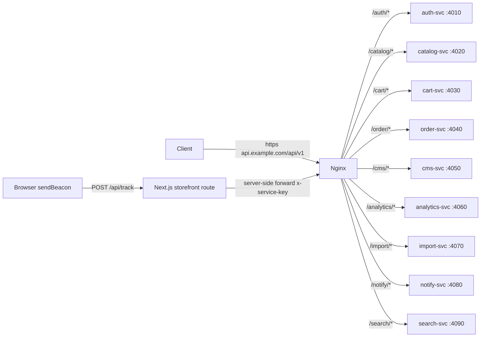
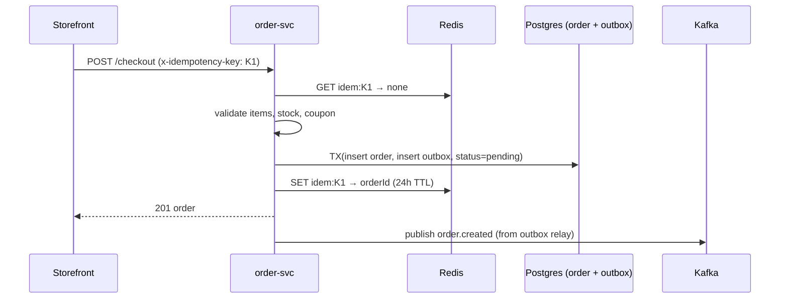
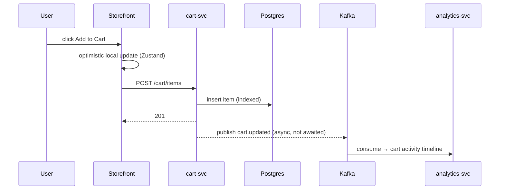
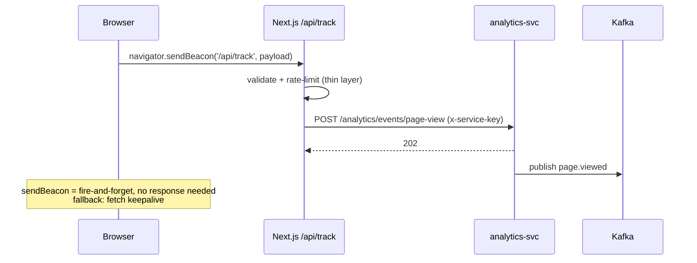
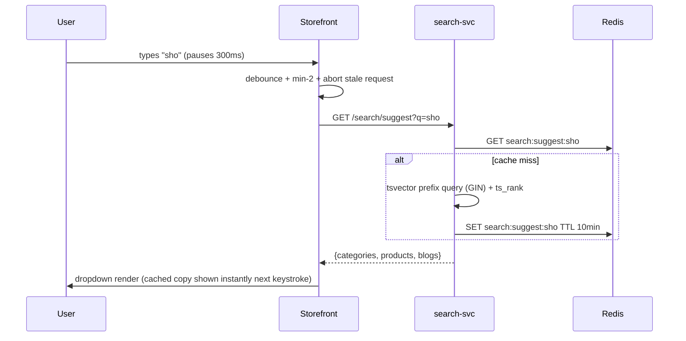

# 4. API Design

> REST API Contracts for All 8 Microservices
> Status: Draft | Last Updated: 2026-08-16
> Parent: `0.Project-Overview.md` | Siblings: `1.Architecture.md`, `3.Database-Schema.md`

---

## 1. API Conventions (global rules)

### 1.1 Base Path & Versioning
- All APIs: `https://api.example.com/api/v1/{route}/*` — routed by Nginx to services (§2).
- Path versioning (`/v1/`) — simplest, cache-friendly; breaking changes bump to `/v2/`.

### 1.2 Authentication Headers
| Header | Where | Value |
|---|---|---|
| `Authorization: Bearer <accessToken>` | storefront/admin → API | Customer or admin JWT (15m) |
| `x-service-key` | service → service | Static internal key per service (v1) |
| `x-request-id` | everywhere | UUID generated at Nginx; echoed in responses + logs |
| `x-idempotency-key` | checkout, cart mutations | UUID from client — dedupe guard (§1.7) |

### 1.3 Pagination
| Context | Strategy | Params | Response |
|---|---|---|---|
| Storefront lists (products, orders, blogs) | **Cursor** | `?cursor=base64(createdAt_uuid)` + `?limit=24` | `{ data: [...], nextCursor: "..." }` — stable under inserts, no offset drift |
| Admin tables | **Offset** | `?page=1&perPage=25` | `{ data: [...], page, perPage, total }` |

Cursor encoding: `base64("<createdAtISO>|<id>")` — lexicographically sortable; `nextCursor: null` = no more pages.

### 1.4 Filtering & Sorting (storefront lists)
- Filters: `?category={slug}`, `?brand={slug}`, `?minPrice=10&maxPrice=100`, `?tag=summer`, `?q=keyword` (search), `?discounted=true`
- Sort: `?sort=price.asc | price.desc | newest | rating` (default `newest`)
- Compare: `?ids=uuid1,uuid2` (max 4)

### 1.5 Error Envelope
```json
{
  "error": {
    "code": "PRODUCT_NOT_FOUND",
    "message": "Product with slug 'x' does not exist",
    "details": [{ "field": "price", "message": "must be >= 0" }]
  },
  "requestId": "5f2c...",
  "timestamp": "2026-08-16T10:00:00Z"
}
```

| Status | Meaning |
|---|---|
| 400 | Validation error (`VALIDATION_FAILED`) |
| 401 | Missing/invalid token (`UNAUTHENTICATED`) |
| 403 | Role insufficient (`FORBIDDEN`) |
| 404 | Not found (`*_NOT_FOUND`) |
| 409 | Conflict — duplicate/invalid state (`DUPLICATE_SKU`, `STOCK_INSUFFICIENT`, `IDEMPOTENCY_CONFLICT`) |
| 422 | Semantic failure (`COUPON_EXPIRED`, `COUPON_USED`) |
| 429 | Rate limited (`RATE_LIMITED`) |
| 500 | Unexpected (`INTERNAL_ERROR`) |

### 1.6 Rate Limits (Nginx, per IP)
| Group | Limit |
|---|---|
| `/auth/login`, `/auth/refresh` | 10 req/s |
| `/order/checkout` | 5 req/s |
| `/analytics/events/*` | 30 req/s |
| All reads | 30 req/s per route |

### 1.7 Idempotency
- `x-idempotency-key` **required** on `POST /order/checkout` and cart mutations.
- Server stores key → response map (Redis, 24h TTL). Replayed key returns the stored response — never double-applies.
- On checkout, the key is also written into `order.outbox.event_id` guard: one key = one order.

### 1.8 Contract-First & OpenAPI
- This doc = contract source of truth. Full OpenAPI 3.1 specs generated later **from NestJS DTOs** (Swagger module), one spec per service, exposed at `GET /api/v1/{route}/docs`. CMS `content` schemas (`ctas[]` max 3) are defined in `shared/src/schemas/cta.schema.ts` (Zod) and exported to OpenAPI via `zod-to-openapi`.
- Event payload contracts live in `1.Architecture.md` §7 — API doc only references them.

---

## 2. Nginx → Service Routing Map



---

## 3. Endpoint Catalog by Service

> Legend: 🛡 = requires auth (customer), 👑 = admin role, ✳ = emits Kafka event (→ §6)

### 3.1 auth-svc — `/api/v1/auth`
| Method | Path | Auth | Request | Response | Events |
|---|---|---|---|---|---|
| POST | `/register` | — | `{email, password, firstName, lastName}` | `201 {user, accessToken, refreshToken}` | `user.registered` ✳ |
| POST | `/login` | — | `{email, password}` | `{user, accessToken, refreshToken}` | — |
| POST | `/logout` | 🛡 | — | `204` | — |
| POST | `/refresh` | — | `{refreshToken}` | `{accessToken, refreshToken}` | — |
| GET | `/me` | 🛡 | — | `{user}` | — |
| PATCH | `/me` | 🛡 | `{firstName?, lastName?, phone?, avatarUrl?}` | `{user}` | — |
| PATCH | `/me/password` | 🛡 | `{currentPassword, newPassword}` | `204` | — |
| GET | `/me/addresses` | 🛡 | — | `[{address}]` | — |
| POST | `/me/addresses` | 🛡 | address body | `201 {address}` | — |
| PATCH | `/me/addresses/:id` | 🛡 | partial address | `{address}` | — |
| DELETE | `/me/addresses/:id` | 🛡 | — | `204` | — |
| GET | `/users` | 👑 | `?page=&status=` | `{data, page, perPage, total}` | — |
| PATCH | `/users/:id/status` | 👑 | `{status}` | `{user}` | — |
| GET | `/roles` | 👑 | — | `[{role, permissions[]}]` | — |
| POST | `/roles` | 👑 | `{name, slug, permissionSlugs[]}` | `201 {role}` | — |
| PATCH | `/users/:id/roles` | 👑 | `{roleSlugs[]}` | `{userRoles}` | — |

### 3.2 catalog-svc — `/api/v1/catalog`
| Method | Path | Auth | Request | Response | Events |
|---|---|---|---|---|---|
| GET | `/products` | — | cursor + filters + sort | `{data[], nextCursor}` | — |
| GET | `/products/:slug` | — | — | product detail (PDP) | — |
| GET | `/products/:id` | — | — | product detail by id | — |
| GET | `/search` **(deprecated — use search-svc §3.9)** | — | `?q=&cursor=` | `{data[], nextCursor}` | — |
| GET | `/compare` | — | `?ids=u1,u2,u3` (max 4) | `{attributes[], products[]}` | — |
| GET | `/categories` | — | — | `{tree[]}` (nested) | — |
| GET | `/brands` | — | — | `{data[]}` | — |
| POST | `/products` | 👑 | product create body | `201 {product}` | — |
| PATCH | `/products/:id` | 👑 | partial product | `{product}` | — |
| DELETE | `/products/:id` | 👑 | — | `204` (soft delete) | — |
| POST | `/products/:id/variants` | 👑 | `{sku, price?, stock?, imageUrl?, options:[{optionId, optionValueId}]}` | `201 {variant}` | — |
| PATCH | `/variants/:id` | 👑 | partial variant | `{variant}` | — |
| DELETE | `/variants/:id` | 👑 | — | `204` | — |
| POST | `/products/:id/options` | 👑 | `{name, values[]}` | `201 {option, values[]}` | — |
| PATCH | `/options/:id` | 👑 | `{name?, values?}` | `{option}` | — |
| POST | `/products/:id/images` | 👑 | `{url, alt?, variantId?}` | `201 {image}` | — |
| PATCH | `/images/:id` | 👑 | `{alt?, sortOrder?, isPrimary?}` | `{image}` | — |
| DELETE | `/images/:id` | 👑 | — | `204` | — |
| POST | `/products/:id/stock` | 👑 | `{delta: int, reason?: 'admin_adjustment'}` | `{stock, movement}` | — |
| GET | `/products/:id/stock-movements` | 👑 | `?cursor=` | `{data[], nextCursor}` | — |
| POST | `/products/:id/discounts` | 👑 | `{discountType, value, startsAt, endsAt}` | `201 {discount}` | — |
| PATCH | `/discounts/:id` | 👑 | partial discount | `{discount}` | — |
| DELETE | `/discounts/:id` | 👑 | — | `204` | — |
| GET | `/attributes` | — | — | compare-attribute defs | — |
| GET | `/reviews` | — | `?productId=&cursor=` | `{data[], nextCursor}` | — |
| POST | `/reviews` | 🛡 | `{productId, rating, title?, body?}` | `201 {review}` [optional] | — |
| PATCH | `/reviews/:id/approve` | 👑 | — | `{review}` [optional] | — |

### 3.3 cart-svc — `/api/v1/cart`
> Cart identity: `Authorization` if logged in, else `x-session-id` header (cookie-set by storefront).
| Method | Path | Auth | Request | Response | Events |
|---|---|---|---|---|---|
| GET | `/cart` | 🛡 or session | — | `{cart, items[], totals}` | — |
| POST | `/cart/items` | 🛡 or session | `{productId, variantId?, qty}` | `201 {item}` | `cart.updated` ✳ |
| PATCH | `/cart/items/:id` | 🛡 or session | `{qty}` | `{item}` | `cart.updated` ✳ |
| DELETE | `/cart/items/:id` | 🛡 or session | — | `204` | `cart.updated` ✳ |
| DELETE | `/cart/items` | 🛡 or session | `{ids[]}` (batch remove) | `204` | `cart.updated` ✳ |
| DELETE | `/cart` | 🛡 or session | — | `204` (clear) | `cart.updated` ✳ |
| POST | `/cart/merge` | 🛡 | — | `{cart}` | `cart.updated` ✳ |
| GET | `/wishlist` | 🛡 | — | `{items[]}` | — |
| POST | `/wishlist/items` | 🛡 | `{productId}` | `201 {item}` | — |
| DELETE | `/wishlist/items/:id` | 🛡 | — | `204` | — |

### 3.4 order-svc — `/api/v1/order`
| Method | Path | Auth | Request | Response | Events |
|---|---|---|---|---|---|
| POST | `/checkout` | 🛡 | checkout body (§4.6) + `x-idempotency-key` | `201 {order}` | `order.created` ✳ |
| GET | `/orders/:id` | 🛡 (owner) / 👑 | — | `{order, items[], payments[]}` | — |
| GET | `/me/orders` | 🛡 | `?cursor=` | `{data[], nextCursor}` | — |
| GET | `/orders` | 👑 | `?page=&status=&from=&to=&q=` | `{data, page, perPage, total}` | — |
| GET | `/orders/:id/status-history` | 👑 | — | `[{from, to, note, actor, createdAt}]` | — |
| PATCH | `/orders/:id/status` | 👑 | `{status, note?}` | `{order}` | `order.status.updated` ✳ |
| POST | `/orders/:id/refund` | 👑 | `{amount?, reason?}` | `{payment}` | `order.status.updated` ✳ |
| POST | `/discount-codes/validate` | 🛡 | `{code, cartTotal}` | `{valid, discount?}` | — |
| GET | `/discount-codes` | 👑 | `?page=` | `{data, page, perPage, total}` | — |
| POST | `/discount-codes` | 👑 | `{code, discountType, value, minOrderAmount?, maxUses?, startsAt?, endsAt?}` | `201 {code}` | — |
| PATCH | `/discount-codes/:id` | 👑 | partial | `{code}` | — |
| DELETE | `/discount-codes/:id` | 👑 | — | `204` | — |

### 3.5 cms-svc — `/api/v1/cms`
> `content` is Zod-validated via `shared/src/schemas/cta.schema.ts` — hero `content.slides[].ctas[]` max 3 and banner `content.ctas[]` max 3; `ctas.length > 3` → `400 VALIDATION_FAILED { field: "content.slides[0].ctas", message: "max 3 CTAs per slide" }`.

| Method | Path | Auth | Request | Response | Events |
|---|---|---|---|---|---|
| GET | `/sections?pageKey=homepage` | — | — | `[{section}]` (public read) | — |
| POST | `/sections` | 👑 | `{key, type, pageKey, content, settings?}` — `content` Zod-validated (`ctas[]` max 3) | `201 {section}` | `cms.updated` ✳ |
| PUT | `/sections/:key` | 👑 | full section body — `ctas[]` max 3 enforced | `{section}` | `cms.updated` ✳ |
| PATCH | `/sections/reorder` | 👑 | `{orderedKeys[]}` | `204` | `cms.updated` ✳ |
| DELETE | `/sections/:key` | 👑 | — | `204` | `cms.updated` ✳ |
| GET | `/settings/global` | — | — | `{theme}` | — |
| PUT | `/settings/global` | 👑 | `{theme}` | `{theme, version}` | `cms.updated` ✳ |
| GET | `/navigation` | — | — | `{navbar}` | — |
| PUT | `/navigation` | 👑 | `{navbar}` | `{navbar}` | `cms.updated` ✳ |
| GET | `/pages` | — | — | `[{page}]` | — |
| GET | `/pages/:slug` | — | — | `{page}` | — |
| POST | `/pages` | 👑 | `{slug, title, blocks[], seo?}` | `201 {page}` | `cms.updated` ✳ |
| PATCH | `/pages/:slug` | 👑 | partial | `{page}` | `cms.updated` ✳ |
| GET | `/blogs` | — | `?category=&cursor=&status=` | `{data[], nextCursor}` | — |
| GET | `/blogs/:slug` | — | — | `{blog}` | — |
| POST | `/blogs` | 👑 | `{title, slug, content[], status, ...}` | `201 {blog}` | — |
| PATCH | `/blogs/:id` | 👑 | partial | `{blog}` | — |
| GET | `/blog-categories` | — | — | `[{category}]` | — |
| POST | `/blog-categories` | 👑 | `{name, slug}` | `201 {category}` | — |
| POST | `/media` | 👑 | multipart file | `201 {media}` | — |
| GET | `/media` | 👑 | `?usage=&page=` | `{data, page, perPage, total}` | — |
| DELETE | `/media/:id` | 👑 | — | `204` | — |

### 3.6 analytics-svc — `/api/v1/analytics`
> Public-facing events arrive via the Next.js `/api/track` route (sendBeacon → server-side forward). Direct hits from browsers are also accepted (CORS-open for the beacon path).
| Method | Path | Auth | Request | Response | Events |
|---|---|---|---|---|---|
| POST | `/events/page-view` | x-service-key | `{sessionId, userId?, page, referrer?, device?, eventKind}` | `202` | `page.viewed` ✳ |
| GET | `/admin/dashboard` | 👑 | `?from=&to=` | `{daily[], totals}` | — |
| GET | `/admin/funnel` | 👑 | `?from=&to=` | `{pageViews, cartAdds, checkouts, conversions}` | — |
| GET | `/admin/exits` | 👑 | `?from=&to=` | `{byPage[], byReferrer[]}` | — |
| GET | `/admin/abandoned-carts` | 👑 | `?page=&status=` | `{data, page, perPage, total}` | — |

### 3.7 import-svc — `/api/v1/import`
| Method | Path | Auth | Request | Response | Events |
|---|---|---|---|---|---|
| POST | `/import` | 👑 | multipart CSV/JSON | `202 {jobId}` | per-product `product.imported` ✳ |
| GET | `/jobs` | 👑 | `?page=&status=` | `{data, page, perPage, total}` | — |
| GET | `/jobs/:id` | 👑 | — | `{job, report}` | — |
| POST | `/import/:source/run` | 👑 | `{credentials?, filters?}` | `202 {jobId}` (Shopify/BigCommerce/Odoo — phase 2) | `product.imported` ✳ |

### 3.8 notify-svc — `/api/v1/notify`
> Almost entirely event-driven (consumes `order.created`, `cart.abandoned`, etc.).
| Method | Path | Auth | Request | Response | Events |
|---|---|---|---|---|---|
| GET | `/admin/emails` | 👑 | `?page=&status=` | `{data, page, perPage, total}` | — |
| POST | `/admin/test-email` | 👑 | `{to, template}` | `202` | — |
| GET | `/admin/templates` | 👑 | — | `[{template}]` [optional] | — |
| PUT | `/admin/templates/:key` | 👑 | `{subject, body}` | `{template}` [optional] | — |

### 3.9 search-svc — `/api/v1/search`
> Typeahead + ranked search over the unified index (products + categories + blogs). Index synced via Kafka events (`product.imported`, `product.updated`, `category.updated`, `blog.updated`) — reads only here, no writes.
| Method | Path | Auth | Request | Response | Events |
|---|---|---|---|---|---|
| GET | `/suggest` | — | `?q=&limit=5` | `{query, categories[], products[], blogs[]}` | — |
| GET | `/search` | — | `?q=&category=&minPrice=&maxPrice=&sort=&cursor=` | `{data[], nextCursor, totalHits}` | — |

---

## 4. Full Contracts — 10 Critical Endpoints

### 4.1 `POST /auth/register`
**Request**
```json
{ "email": "user@example.com", "password": "Str0ng!pass", "firstName": "Jane", "lastName": "Doe" }
```
**Response `201`**
```json
{
  "user": { "id": "0190...", "email": "user@example.com", "firstName": "Jane", "lastName": "Doe", "role": "customer" },
  "accessToken": "eyJ...", "refreshToken": "rt_..."
}
```
**Emits:** `user.registered` (welcome email, cohort analytics). **Errors:** `400` invalid email/weak password; `409` email exists.

### 4.2 `POST /auth/login`
**Request** `{ "email": "...", "password": "..." }` · **Response** same shape as 4.1 · **Errors:** `401` bad credentials.

### 4.3 `GET /catalog/products?category=shoes&minPrice=20&maxPrice=100&sort=price.asc&cursor=...&limit=24`
**Response `200`**
```json
{
  "data": [
    { "id": "0190...", "slug": "running-shoe-x", "name": "Running Shoe X", "price": 79.99, "compareAtPrice": null,
      "image": { "url": "https://cdn.../1.jpg", "alt": "Running Shoe X" }, "rating": 4.5 }
  ],
  "nextCursor": "MjAyNi0wOC0xNlQxMDowMDowMFp8MDE5M..."
}
```

### 4.4 `GET /catalog/products/:slug` (PDP)
**Response `200`**
```json
{
  "id": "0190...", "slug": "running-shoe-x", "name": "Running Shoe X", "description": "...",
  "price": 79.99, "compareAtPrice": 99.99, "effectivePrice": 71.99,
  "discount": { "discountType": "percent", "value": 10, "endsAt": "2026-08-20T00:00:00Z" },
  "images": [{ "url": "...", "alt": "...", "sortOrder": 0, "isPrimary": true }],
  "options": [
    { "id": "o1", "name": "Size", "values": [{ "id": "v1", "value": "S" }, { "id": "v2", "value": "M" }] },
    { "id": "o2", "name": "Color", "values": [{ "id": "v4", "value": "Red" }, { "id": "v5", "value": "Blue" }] }
  ],
  "variants": [{ "id": "var1", "sku": "RSX-S-RED", "price": 79.99, "stock": 12, "imageUrl": null, "options": { "Size": "S", "Color": "Red" } }],
  "attributes": [{ "slug": "material", "name": "Material", "value": "Mesh" }],
  "photoSettings": { "format": "horizontal", "ratio": "4:3", "layout": "carousel", "blendMode": "multiply" },
  "stock": { "total": 34, "status": "in_stock" }
}
```
`effectivePrice` = lowest active discount applied (computed in catalog-svc). Variant `options` resolved from junction joins — this is the PDP's only "many" payload.

### 4.5 `POST /catalog/products` (admin create)
**Request**
```json
{
  "sku": "RSX-100", "name": "Running Shoe X", "slug": "running-shoe-x",
  "categoryId": "cat-1", "brandId": "br-2", "price": 79.99, "compareAtPrice": 99.99, "stock": 50,
  "description": "...", "tags": ["shoes", "running"],
  "photoSettings": { "format": "vertical", "ratio": "1:1", "layout": "grid", "gutter": 8, "blendMode": "normal" }
}
```
**Response `201`** — product object as 4.4 (without computed fields). **Errors:** `409 DUPLICATE_SKU`, `400` validation.

### 4.6 `POST /order/checkout` (idempotent)
Header: `x-idempotency-key: 5f2c...`
**Request**
```json
{
  "items": [{ "productId": "0190...", "variantId": "var1", "qty": 2 }],
  "shippingAddress": { "line1": "...", "city": "...", "postalCode": "...", "country": "US" },
  "billingAddress": { "line1": "...", "city": "...", "postalCode": "...", "country": "US" },
  "discountCode": "SAVE10",
  "payment": { "provider": "mock" }
}
```
**Response `201`**
```json
{
  "orderId": "0190...", "orderNumber": "#2026-000123", "status": "pending",
  "totals": { "subtotal": 159.98, "shipping": 5.0, "tax": 9.9, "discount": 15.99, "grandTotal": 158.89 },
  "items": [{ "productName": "Running Shoe X", "sku": "RSX-100", "unitPrice": 79.99, "qty": 2, "lineTotal": 159.98 }]
}
```
**Emits:** `order.created` via **transactional outbox** (same TX as order insert). **Errors:** `409 STOCK_INSUFFICIENT`, `422 COUPON_EXPIRED` / `COUPON_USED`, `409 IDEMPOTENCY_CONFLICT` (key reused with different body). **Replay:** same key → returns original stored response.

### 4.7 `POST /cart/items`
Header: `x-idempotency-key` (optional), `x-session-id` for guests.
**Request** `{ "productId": "0190...", "variantId": "var1", "qty": 1 }` · **Response `201`** `{ "item": { "id": "ci-1", "productId": "...", "variantId": "...", "qty": 1, "unitPrice": 79.99 }, "cartTotals": { ... } }` · **Emits:** `cart.updated` fire-and-forget.

### 4.8 `DELETE /cart/items` (batch remove)
**Request** `{ "ids": ["ci-1", "ci-2", "ci-3"] }` · **Response `204`** · **Emits:** one `cart.updated`. Performance: 1 round trip instead of N (P99 < 100ms target @ 200 items).

### 4.9 `POST /import/import` (multipart upload)
**Request** `multipart/form-data`: `file` (CSV/JSON), fields: `source=csv`, `options={ "stockMode": "replace" }` · **Response `202`** `{ "jobId": "0190...", "status": "pending" }` · **Flow:** import-svc validates → per-product `product.imported` events → report on `GET /jobs/:id` `{ totalRows, successCount, failedCount, errors[] }`.

### 4.10 `GET /cms/sections?pageKey=homepage`
**Response `200`**
```json
{
  "sections": [
    {
      "key": "home-hero",
      "type": "hero",
      "content": {
        "slides": [
          {
            "id": "slide_01",
            "headline": "Summer Sale",
            "image": "s3://.../hero-01.jpg",
            "ctas": [
              { "id": "cta_01", "text": "Shop now", "link": "/products", "bg": "#111111", "textColor": "#ffffff", "borderRadius": 6 }
            ]
          }
        ]
      },
      "settings": { "ratio": "16:9", "blendMode": "multiply" },
      "sortOrder": 0,
      "isActive": true
    },
    {
      "key": "home-banner-01",
      "type": "banner",
      "content": { "title": "Free shipping over $50", "image": "s3://.../banner.jpg", "ctas": [{ "id": "cta_b1", "text": "Learn more", "link": "/about" }] },
      "settings": {},
      "sortOrder": 1,
      "isActive": true
    }
  ],
  "version": 7
}
```
`version` = global settings cache-buster; storefront caches by version. Each `ctas` array is `0..3` items (`z.array(ctaSchema).max(3)`); `ctas: []` renders no CTA row. Legacy docs with flat `ctaText/ctaLink` are auto-migrated to `ctas[0]` in the resolver.

### 4.11 `GET /search/suggest?q=sho&limit=5`
**Response `200`** — one combined payload, deliberately lightweight (no ranking, no filters, `5+5+5` max):
```json
{
  "query": "sho",
  "categories": [{ "id": "c1", "name": "Shoes", "slug": "shoes", "image": "https://cdn.../c1.jpg" }],
  "products": [
    { "id": "0190...", "slug": "running-shoe-x", "name": "Running Shoe X", "image": "https://cdn.../1.jpg", "price": 79.99, "effectivePrice": 71.99 }
  ],
  "blogs": [{ "id": "b1", "slug": "best-running-shoes-2026", "title": "Best Running Shoes 2026", "cover": "https://cdn.../b1.jpg" }]
}
```
Server-side: `to_tsquery('english', 'sho:*')` prefix match (GIN index), `status='active'`, ordered by `ts_rank` + popularity; Redis-cached `search:suggest:sho` TTL 10min. Client-side contract: debounce 300ms, min 2 chars, AbortController, in-memory cache + stale-while-revalidate (spec in `5.Features.md`).

---

## 5. Critical Flow Sequences

### 5.1 Checkout (idempotency + outbox)


### 5.2 Cart add (optimistic + fire-and-forget)


### 5.3 Page-view beacon (sendBeacon chain)


### 5.4 Typeahead suggest (debounced, cached)


---

## 6. Event ↔ Endpoint Traceability

| Event (from `1.Architecture.md` §7) | Produced by | Via endpoint/flow |
|---|---|---|
| `cart.updated` | cart-svc | `POST/PATCH/DELETE /cart/items`, batch remove, clear, merge |
| `cart.abandoned` | analytics-svc | Detector consumer (no REST origin) |
| `order.created` | order-svc | `POST /order/checkout` → outbox relay |
| `order.status.updated` | order-svc | `PATCH /orders/:id/status`, `POST /orders/:id/refund` |
| `product.imported` | import-svc | `POST /import/import` (per valid row) |
| `page.viewed` | analytics-svc | `POST /analytics/events/page-view` (via `/api/track`) |
| `user.registered` | auth-svc | `POST /auth/register` |
| `cms.updated` | cms-svc | Section/settings/navigation/page writes (§3.5 ✳) |
| `product.updated` | catalog-svc | `PATCH /products/:id`, variant/option writes |
| `category.updated` | catalog-svc | Category create/update (admin) |
| `blog.updated` | cms-svc | Blog create/update/publish (admin) |

Consumers per event: see `1.Architecture.md` §6.4. Search index sync consumers: `product.imported`, `product.updated`, `category.updated`, `blog.updated` → search-svc.

---

## 7. Service-to-Service API Map (internal, `x-service-key`)

| Caller | Target | Call | Purpose |
|---|---|---|---|
| order-svc | catalog-svc | `GET /internal/stock?productId=&variantId=` | Stock validation at checkout |
| order-svc | catalog-svc | `POST /internal/stock/reserve` | Reservation during checkout (compensation on failure) |
| order-svc | cart-svc | `DELETE /internal/carts/:id` | Mark cart converted post-order |
| cart-svc | catalog-svc | `GET /internal/products?ids=` | Cart render enrichment (names, images) |
| storefront (Next.js) | analytics-svc | `POST /analytics/events/page-view` | Beacon forward (§5.3) |
| storefront | cms-svc | `GET /sections`, `GET /settings/global` | SSR CMS reads (via Redis cache first) |
| storefront | search-svc | `GET /api/v1/search/suggest`, `GET /api/v1/search` | Typeahead dropdown + full search page |
| search-svc | — (Kafka only) | consumes `product.imported` / `product.updated` / `category.updated` / `blog.updated` | Index sync — no REST deps |
| admin | import-svc | `GET /jobs/:id` | Poll import report |

> Internal endpoints use `/internal/*` path prefix — not exposed through Nginx public routing.

---

## 8. Related Documents

- `1.Architecture.md` — event contracts, Kafka topology, Nginx routing
- `3.Database-Schema.md` — tables behind every endpoint
- `5.Features.md` — acceptance criteria per feature
- `6.Admin-Panel.md` — admin UX consuming these APIs
- Per-service docs `9–17` — implementation: guards, DTOs, Swagger config, outbox relay internals
